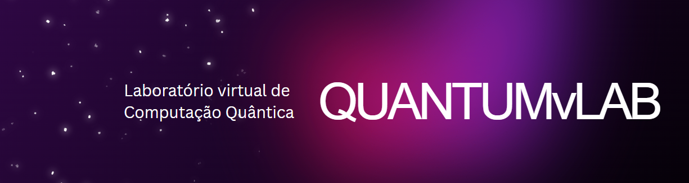

<p align="center">
  
</p>

## Quantum Statevector Simulation on Deucalion

A hands-on tutorial series that takes you from **quantum computing foundations** → **HPC statevector theory** → **real jobs on the Deucalion supercomputer**.

- **Language & stack:** Tutorial primarily in Python + Qulacs, with examples also for Qiskit Aer and PennyLane.
- **Target cluster:** Deucalion's ARM, x86 and A100 GPU partitions.
- **Focus:** Scaling **statevector simulation**; practical memory sizing; node/thread/GPU mapping; Working slurm job scripts.

⚡ Quickstart on Deucalion - You must request access to the cluster. Setup an account [here](https://docs.macc.fccn.pt/start/).

---

### 🔎 Why this repo

- Quantum computing enthusiasts often lack the resources for large-scale simulations on their local machines and lack the expertise to set up HPC environments.
- **Qulacs** is one of the fastest quantum statevector simulators in practice and it is highly optimized to run on Deucalion's ARM architecture. However, there is little documentation available for users unfamiliar with HPC concepts and large scale Qulacs usage.
- You get **copy-pasteable** Slurm scripts for CPU and GPU allocations.
- Clear, cluster-specific **memory tables** up to 40+ qubits to ease the process of requesting the right resources and simplify quantum simulation on Deucalion.

---

### 📚 What’s inside

1. **Part 1 — Quantum computing & classical simulation**  
   Quantum computing through linear algebra and Dirac notation; single- & two-qubit gates; what’s classically easy/hard and statevector simulation.  
   👉 Read: **[part1_quantum_computing_and_classical_simulation.md](part1_quantum_computing_and_classical_simulation.md)**  

2. **Part 2 — Statevector simulation on HPC**  
   Parallelization and distributed statevectors; Deucalion sizing tables for ARM/x86/GPU.  
   👉 Read: **[part2_statevector_simulation_on_hpc.md](part2_statevector_simulation_on_hpc.md)**  

3. **Part 3 — Statevector simulation on Deucalion**  
   Slurm basics; Deucalion's partitions overview; safe memory budgets; **working job scripts** for **GHZ**, **Grover**, and **QAOA** on ARM nodes.  
   👉 Read: **[part3_statevector_simulation_on_deucalion.md](part3_statevector_simulation_on_deucalion.md)**  

4. **Benchmarks — Grover & QAOA on Deucalion**
   Performance benchmarks for Grover’s algorithm and QAOA on Deucalion’s ARM, x86 and GPU partitions.  
   👉 Read: **[benchmarks.md](benchmarks.md)**
   
5. **Scripts — ready-to-run Python & Slurm job scripts**  
   A large set of examples lives in **`scripts/`**, organized by partition type:
   - **`scripts/arm_partition/`** — ARM A64FX CPU nodes; GHZ/Grover/QAOA with MPI/OpenMP in Qulacs, Qiskit and Pennylane; Matching `jobscript_*.sh`. 
   - **`scripts/x86_partition/`** — x86 EPYC CPU nodes; mirrors ARM examples with x86-tuned jobscripts.
   - **`scripts/gpu_partition/`** — A100 GPU nodes; Qulacs GPU and PennyLane/Qiskit Aer examples that leverage NVIDIA cuQuantum.
   Each example folder contains the Python source (e.g., `*.py`) **and** a Slurm job script you can submit as-is.

6. **PennyLane (Lightning-Kokkos + MPI) — Manual install & Slurm**
   Build-from-source instructions to enable distributed statevector simulation on Deucalion’s ARM nodes (OpenMP + MPI), plus usage notes.  
   👉 Read: **[README_pennylane.md](README_pennylane.md)**
   
> 💡 Tip: Skim Part 3 first if you just want to run jobs now; circle back to Parts 1–2 for theory and why the scripts are shaped this way.

---


### ▶️ Running examples

1) **Set your billing account in the jobscript**

Open the example’s `jobscript_*.sh` and set:

```bash
#SBATCH --account=<your account>
```

> 💡 Tip: On Deucalion, accounts usually end with a (ARM), x (x86), or g (GPU). Example: i20240010a for ARM.

Need to confirm your accounts?

```bash
sacctmgr show Association where User=<username> format=Cluster,Account%30,User
```

2)	**Submit and monitor (ARM example: GHZ)**

```bash
cd scripts/arm_partition/ghz
sbatch jobscript_ghz.sh
squeue --me                          # monitor your job
less ghz_<jobid>.out                 # inspect results
```


### ⚙️ PennyLane on Deucalion (Lightning-Kokkos + MPI)

PennyLane’s Lightning-Kokkos device is **not yet available as a module** on Deucalion.  
If you want to run **distributed** simulations (MPI) with PennyLane:

- Follow the manual build guide: **[README_pennylane.md](README_pennylane.md)**.
- Then try the ready-to-run examples in **`/scripts`**.

### 🔖 References
- Deucalion user guide - https://docs.macc.fccn.pt
- Qulacs Docs — https://qulacs.readthedocs.io/en/latest/
- Quantum Native Dojo — https://dojo.qulacs.org/en/latest/
- Suzuki et al., Qulacs: a fast and versatile quantum circuit simulator (2020) — https://arxiv.org/pdf/2011.13524
- Faster Schrödinger-style simulation of quantum circuits — https://arxiv.org/pdf/2008.00216
- PennyLane demos (Clifford, Tensor Networks) — https://pennylane.ai/qml/demos/
- Nielsen, M. A., & Chuang, I. L. (2010). Quantum Computation and Quantum Information: 10th Anniversary Edition. Cambridge: Cambridge University Press.