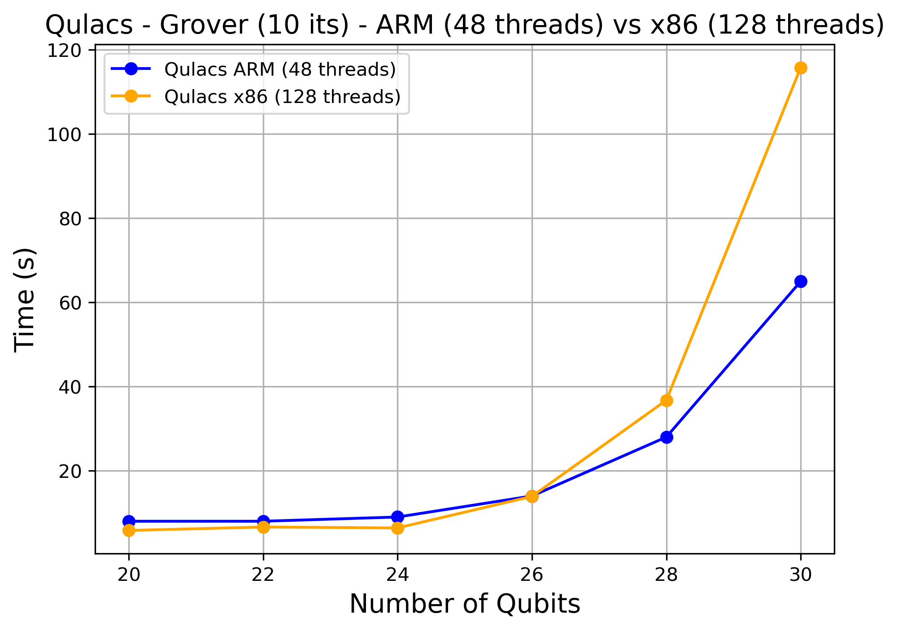
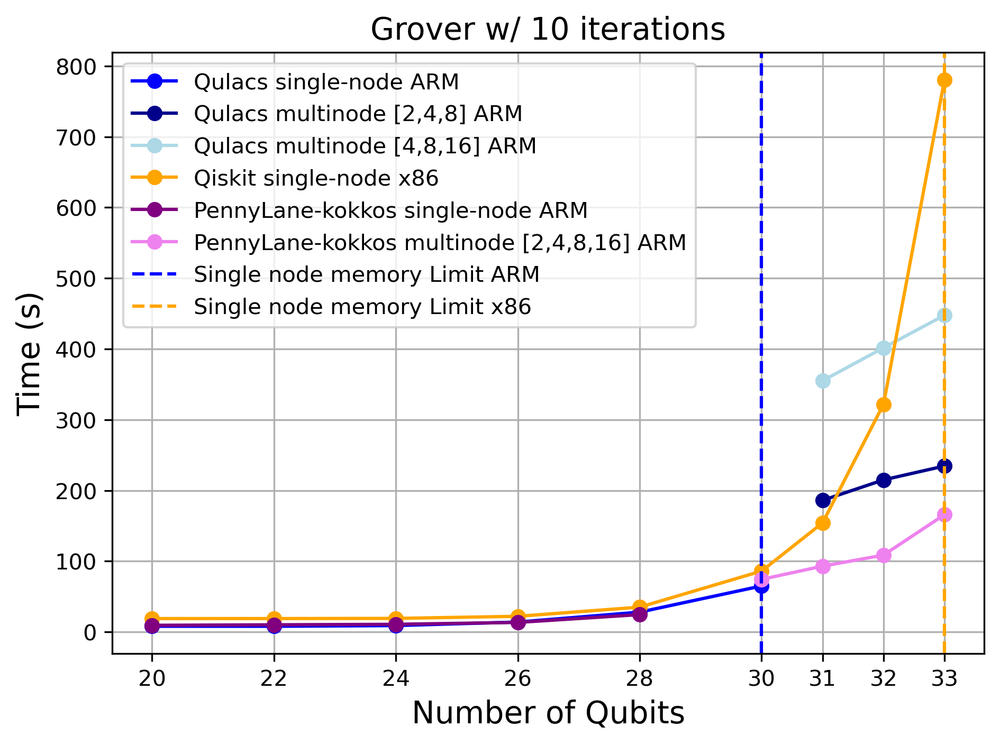
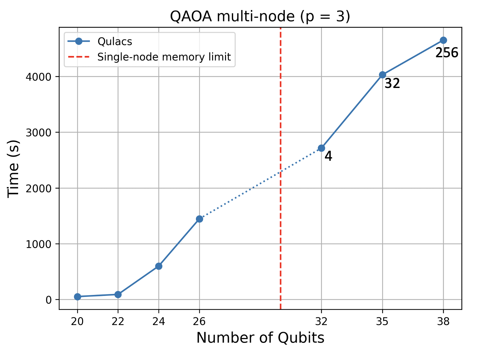

# Quantum statevector simulation on Deucalion - Benchmarks

1. [Grover's algorithm](#1-grovers-algorithm)  
   1.1 [ARM job](#11-arm-job)  
   1.2 [GPU job](#12-gpu-job)  
   1.3 [Performance summary](#13-performance-summary)
2. [Quantum Approximate Optimization Algorithm (QAOA)](#2-quantum-approximate-optimization-algorithm-qaoa)
    2.1 [ARM job](#21-arm-job)
---

### 1. Grover's algorithm

Grover’s algorithm is the canonical quantum routine for finding a marked item in an **unstructured** database. If a classical search needs $O(N)$ oracle queries to scan $N$ items, Grover promises $O(\sqrt{N})$ queries by repeatedly amplifying the probability of the correct answer. This results in a quadratic speedup. Once you can build the **oracle** for a given problem, the same speedup applies to many tasks (e.g., SAT-style search, or inverting a hash on a fixed domain).

---

Suppose we have $N=2^n$ basis states with bitstrings $x=x_1\ldots x_n$ and $M$ of them are marked as solutions.

1) **Create the uniform superposition.**  
  Start from $|0\rangle^{\otimes n}$ and apply Hadamard gates to all qubits:

  $$
  |s\rangle = H^{\otimes n}|0\ldots 0\rangle
  = \frac{1}{\sqrt{N}} \sum_{x\in\{0,1\}^n} |x\rangle .
  $$

1) **Oracle (phase flip the solutions).**  
  The oracle \(U_w\) flips the phase of solution states and leaves others unchanged:

$$
U_w = I - 2 \sum_{w \in \text{solutions}} |w\rangle \langle w|
$$

$$
U_w|x\rangle =
\begin{cases}
-|x\rangle, & \text{if } x \text{ is a solution},\\
|x\rangle, & \text{otherwise.}
\end{cases}
$$

2) **Diffusion (inversion about the mean and amplitude amplification).**  
  Reflect the state about the average amplitude using

  $$
  U_s = 2|s\rangle\langle s| - I
  $$

3) **Grover iteration.**  
  Apply the pair $U_s U_w$ repeatedly. For
  
  $$
  k \approx O\big(\sqrt{N/M}\big)
  $$

  iterations, the marked subspace has the highest probability amplitude.

4) **Measure.**  
  Measure in the computational basis. With high probability you obtain one of the marked bitstrings \(w\).

--- 

In practice, the optimal number of iterations and probability associated with the marked subspace can be estimated as follows: Let $N=2^n$ be the search space, $M$ the number of marked items. Let $|w\rangle$ and $|w_\perp\rangle$ be the uniform superpositions of the marked and unmarked states, respectively.

Define the angle $\theta$ by

$$
\sin^2\theta=\frac{M}{N}\quad\Longleftrightarrow\quad \theta=\arcsin\sqrt{\frac{M}{N}}
$$

Starting from the uniform state $|s\rangle=\sin\theta|w\rangle+\cos\theta |w_\perp\rangle$ after $k$ Grover iterations the state is

$$
|\psi_k\rangle=\sin\big((2k+1)\theta\big)|w\rangle+\cos\big((2k+1)\theta\big)|w_\perp\rangle
$$

Hence the **success probability** (total probability on all marked states) is

$$
P_k=\sin^2\big((2k+1)\theta\big)
$$

To maximize $P_k$, we want the argument to be as close as possible to $\pi/2$:

$$
(2k+1)\theta \approx \frac{\pi}{2}\quad\Longrightarrow\quad
k^\star \approx \frac{\pi}{4\theta}-\frac{1}{2}
$$

Because $k$ must be an integer, choose

$$
\boxed{k_{\mathrm{opt}}=\left\lfloor \frac{\pi}{4\theta}-\frac{1}{2}\right\rfloor}
$$

Assume $\theta = \arcsin\left(\sqrt{\frac{M}{N}}\right)$ and use $\arcsin(x) \approx x$ for $|x| \ll 1$ (i.e., $M \ll N$). Then

$$
\theta \approx \sqrt{\frac{M}{N}} \qquad
k_{\mathrm{opt}} \approx \frac{\pi}{4\theta} - \frac{1}{2}
\approx
\frac{\pi}{4}\sqrt{\frac{N}{M}} - \frac{1}{2}
$$

> That’s all: **prepare**, **phase-flip**, **diffuse**, **repeat**, **measure**. In the next subsection we’ll map these operators to gates and show a concrete Qulacs implementation suitable for Deucalion’s ARM and GPU nodes.

---

Below we decompose the script into the three core building blocks of Grover’s algorithm—**superposition**, **oracle**, and **diffuser**—and explain how each is implemented in Qulacs. In Sections 3.2.1 and 3.2.2 we will discuss the ARM and GPU implementations, respectively.


Allocate an $n$-qubit **state vector** and turn $|0\rangle^n$ into the uniform superposition by applying a Hadamard to each qubit.

```python
import numpy as np
from qulacs import QuantumCircuit, QuantumState

# Allocate the (optionally distributed) state
state = QuantumState(n_qubits, use_multi_cpu=True)
state.set_zero_state()  # |0...0>

# Build H^{⊗n} to create |s>
def make_Hadamard(nqubits):
    Hadamard = QuantumCircuit(nqubits)
    for i in range(nqubits):
        Hadamard.add_gate(H(i))
    return Hadamard

Hadamard = make_Hadamard(n_qubits)
Hadamard.update_quantum_state(state)  # state := |s>
```

>Note: If you run with one rank (--ntasks=1), use_multi_cpu=True simply doesn’t distribute anything (it behaves like the regular state) and threading is still governed by OpenMP.

For the oracle the logic is to apply a global phase (-1) only to the target basis state ($|w\rangle$). The common trick is to map the target to $|11\ldots1\rangle$, apply a multi-controlled Z that flips the phase of $|11\ldots1\rangle$, then undo the mapping.

```python
def Oracle(nqubits, target_state=None):
    U_w = QuantumCircuit(nqubits)

    # 1) Pre-process: X on positions where target bit == 0
    #    This maps the marked string -> all-ones mask.
    for i in range(nqubits):
        if target_state[i] == 0:
            U_w.add_gate(X(i))

    # 2) Multi-controlled Z on the last qubit, controlled on all others being 1
    CnZ = to_matrix_gate(Z(nqubits-1))
    for i in range(nqubits-1):
        CnZ.add_control_qubit(control_index=i, control_with_value=1)
    U_w.add_gate(CnZ)

    # 3) Undo the pre-processing X gates
    for i in range(nqubits):
        if target_state[i] == 0:
            U_w.add_gate(X(i))

    return U_w
``` 
Step (1) turns the specific $|w\rangle$ into $|11\ldots1\rangle$. Step (2) applies a phase flip only when all controls are 1, i.e., on $|11\ldots1\rangle$. Step (3) restores the original computational basis, so only $|w\rangle$ carries the (-1) phase.

The diffuser is expressed by the operator $U_s = 2|s\rangle\langle s| - I$. The standard circuit that realizes it is 

$$
U_s = H^{\otimes n}\big(2|0\rangle\langle 0| - I\big)H^{\otimes n}.
$$

The middle term $(2|0\rangle\langle0| - I)$  is a selective phase flip of the all-zero state.

```python
def Diffuser(nqubits):
    U_s = QuantumCircuit(nqubits)

    # Enter Hadamard basis: |ψ> -> H^{⊗n}|ψ>
    for i in range(nqubits):
        U_s.add_gate(H(i))

    # Implement (2|0><0| - I):
    # - RZ(2π) on the last qubit gives a global -I (phase -1 to all states)
    U_s.add_gate(to_matrix_gate(RZ(nqubits-1, 2*np.pi)))

    # - Toggle the last qubit with X so a subsequent controlled-Z can key off "all controls = 0"
    U_s.add_gate(X(nqubits-1))

    # - Multi-controlled Z acting only when controls are |0> (i.e., on |0...0>)
    CnZ = to_matrix_gate(Z(nqubits-1))
    for i in range(nqubits-1):
        CnZ.add_control_qubit(control_index=i, control_with_value=0)
    U_s.add_gate(CnZ)

    # - Undo the X toggle on the last qubit
    U_s.add_gate(X(nqubits-1))

    # Leave Hadamard basis: apply H^{⊗n} again
    for i in range(nqubits):
        U_s.add_gate(H(i))

    return U_s

```

Now, Grover's algorithm repeats the oracle and diffuser for the optimal number of steps calculated previously. To that end, we first need to define the target state to find. In this case is the all ones bitstring. 

```python
# Mark the all-ones string
marked_state = [1] * n_qubits
U_w = Oracle(n_qubits, target_state=marked_state)
U_s = Diffuser(n_qubits)

# Ideal iteration count ~ floor((π/4)*sqrt(N/M)); here M=1
elements = 1
optimal_iterations = int(np.floor(np.pi/4 * np.sqrt(2**n_qubits / elements)))

# Demo: run 2 Grover iterations (use optimal_iterations for best success prob.)
for i in range(2):
    U_w.update_quantum_state(state)
    U_s.update_quantum_state(state)

# Inspect the final amplitudes (magnitude only)
statevector = abs(state.get_vector())
print("statevector: ", statevector)
```

Additionally you can use `qulacsviz`to visualize the Grover circuit.

```python
def build_grover_circuit(n_qubits, iterations, oracle_circuit, diffuser_circuit, hadamard_circuit):
    grover_circuit = QuantumCircuit(n_qubits)

    grover_circuit.merge_circuit(hadamard_circuit)

    for _ in range(iterations):
        grover_circuit.merge_circuit(oracle_circuit)
        grover_circuit.merge_circuit(diffuser_circuit)
    return grover_circuit

grover_circuit = build_grover_circuit(
    n_qubits=n_qubits,
    iterations=2,
    oracle_circuit=U_w,
    diffuser_circuit=U_s,
    hadamard_circuit=Hadamard
)


circuit_drawer(grover_circuit, 'mpl')
```

That for two Grover iterations would result in the circuit depicted in Figure 1. 

<div align="center">


<p><em>Figure 1: Grover's algorithm circuit for 2 iterations, visualized with qulacsviz.</em></p>

</div>

#### 1.1 ARM job

```bash
#!/bin/bash
#SBATCH --job-name=qulacs-grover
#SBATCH --account=<your account>
#SBATCH --partition=normal-arm
#SBATCH --time=00:30:00

#SBATCH --nodes=32
#SBATCH --ntasks=32                 
#SBATCH --cpus-per-task=48   
#SBATCH --exclusive
#SBATCH --output=grover_%j.out
#SBATCH --error=grover_%j.err

module load qulacs

# OpenMP pinning for each rank
export OMP_NUM_THREADS=${SLURM_CPUS_PER_TASK}
export OMP_PLACES=cores
export OMP_PROC_BIND=spread

srun python grover_multicpu.py --n_qubits 31
```
The jobscript above requests 32 nodes and 32 `--ntasks`. From Table 3 using the `normal-arm` partition we would be able to simulate Grover's algorithm up to a maximum of 35 qubits. Test it yourself using the Grover scripts in `scripts/arm_partition/grover`.

#### 1.2 GPU job 

```bash 
#!/bin/bash
#SBATCH --job-name=Grover_GPU
#SBATCH --account=<your account>
#SBATCH --partition=normal-a100-40
#SBATCH --nodes=1
#SBATCH --gpus=1
#SBATCH --ntasks=1
#SBATCH --cpus-per-task=32
#SBATCH --time=24:00:00
#SBATCH --mem=0
#SBATCH --array=28
#SBATCH -o grover_gpu_%a_%j.out 
#SBATCH -e grover_gpu_%a_%j.err

# Load environment
ml qulacs/0.6.11-foss-2023a-CUDA-12.1.1

srun python grover_example.py --n_qubits 28
```

This example uses the **GPU-enabled Qulacs module** (`ml qulacs/0.6.11-foss-2023a-CUDA-12.1.1`) rather than the CPU-only build. When running on GPU, your Python code must construct the state with **`QuantumStateGpu`** (not `QuantumState`), e.g.

```python
from qulacs import QuantumCircuit, QuantumStateGpu
state = QuantumStateGpu(n_qubits)      # GPU-backed state vector
# ... build circuit, then:
circuit.update_quantum_state(state)
```

The resource request pairs --gpus=1 with --cpus-per-task=32, a sensible default on normal-a100-40 (see Section 1).

⚠️ Note: As of now, Qulacs does not support a single distributed state vector across multiple GPUs. If you need multi-GPU distribution, you should use a different framework (e.g., nvidia CuQuantum or PennyLane / Qiskit that support easy access to multi-GPU simulation using nvidia CuQuantum as backend). See the provided examples under `scripts/gpu_partition/`.

#### 1.3 Performance summary

To better understand the performance of quantum circuit simulators on Deucalion, we benchmarked **Grover’s algorithm** with 10 iterations across different hardware partitions and simulation backends. For each configuration, we measured the **execution time as a function of the number of qubits**, averaging over three independent runs to smooth out noise.

---

**Qulacs: ARM vs x86**  

Figure&nbsp;2 isolates the performance of the **Qulacs simulator** for a single-node execution comparing Deucalion’s ARM and x86 CPU partitions. The results show that Qulacs on a small number of qubits regime has similar performance on ARM and x86. However, once we increase the number of qubits towards the single-node memory limit Qulacs on ARM starts outperforming the x86 partition. Crucially, ARM shows better performance even though it uses only 48 threads instead of the 128 threads available in x86. This confirms the suitability of ARM for large-scale statevector simulations. 


<div align="center">



<p><em>Figure 2: Grover's algorithm with 10 iterations: Qulacs performance comparison between Deucalion's ARM and x86 partition.</em></p>

</div>

--- 

**Cross-simulator comparison**  

Figure&nbsp;3 broadens the scope by comparing the **best-performing configuration of each simulator**—Qulacs, Qiskit, and PennyLane—on both ARM and x86. For clarity, only the fastest variant of each simulator–partition pair is included in the plot. Vertical dashed lines mark the **single-node memory limits**, namely **30 qubits for ARM** and **33 qubits for x86**, as derived in Table&nbsp;3 and Table&nbsp;4, respectively. 

<div align="center">



<p><em>Figure 3: Grover's algorithm with 10 iterations: Qulacs, Qiskit and PennyLane performance comparison between Deucalion's ARM and x86 partitions with single and multi node.</em></p>

</div>

Within the single-node regime, Qulacs on ARM is also slightly faster than Qiskit on x86, underscoring again the advantage of Qulacs on single-node computation. Beyond 30 qubits, Qulacs on ARM requires doubling the number of nodes. Still, it can be clearly seen that in the multi-node regime Qulacs on ARM remains faster than Qiskit on x86 single-node, although using more resources for 32 and 33 qubits.

Note that in the plot there are no multi-node results for Qiskit. This is because, as of this writing, **Qiskit installation on Deucalion does not support multi node and multi threading simultaneously**, and therefore, the performance is substantially hindered.  

A particularly interesting result comes from the **PennyLane Lightning-Kokkos backend**, which was installed manually and it is not yet available on Deucalion as a simple `ml pennylane` module. (For users interested in reproducing our results, instructions are provided in [README_pennylane.md](README_pennylane.md).) In the single-node regime, PennyLane-Kokkos on ARM performs **at least comparably to Qulacs ARM**, which is notable given its recent appearance in the HPC ecosystem. However, due to current memory management limitations, PennyLane-Kokkos ARM is unable to simulate 30 qubits in a single node, reaching only 28 qubits. Beyond this point, the simulator requires **twice as many nodes as Qulacs ARM** for the same problem size. This limitation is already being addressed by the PennyLane developers ([GitHub issue #1176](https://github.com/PennyLaneAI/pennylane-lightning/pull/1176)), and once resolved, we expect PennyLane to extend its single-node reach and lower its multi-node requirements. Still, PennyLane-Kokkos ARM demonstrates superior multi-node performance, noticing Qulacs ARM performance with the same number of nodes as PennyLane-Kokkos ARM (depicted in light blue) indicating strong potential for scaling once the memory fix is in place.

In summary, our Grover benchmark reveals a nuanced landscape:  
- **Qulacs on ARM** is currently the fastest and most reliable simulator up to 30 qubits.  
- **PennyLane-Kokkos ARM** already shows competitive performance and may surpass Qulacs ARM in the multi-node regime using a MPI supported from source installation (See [README_pennylane.md](README_pennylane.md) for instructions).
- **Qiskit**, while widely used, lags behind in performance. Specially in the multi-node regime due to lack of multi-node and multi-threading support in the current installation on Deucalion.

These results emphasize the importance of continuous benchmarking, as simulator performance is evolving rapidly and software improvements can shift the balance of best practices for Deucalion users.

 
---


### 2. Quantum Approximate Optimization Algorithm (QAOA)

QAOA is a variational, gate-based algorithm designed for **combinatorial optimization** on near-term (NISQ) devices. Much like quantum annealing, it searches for bitstrings that minimize a classical objective, but it does so with a **parameterized circuit** whose angles are tuned by a classical optimizer. 

QAOA with **constant depth** realizes shallow quantum circuits whose output distributions are, under widely held complexity-theoretic assumptions (e.g., non-collapse of the polynomial hierarchy), **believed to be classically hard to sample** from even approximately. Intuitively, the circuit creates global interference patterns tied to the problem structure; reproducing these correlations with a classical sampler would imply unlikely collapses in complexity classes.

 Practically, this places QAOA in a sweet spot: shallow enough for present hardware, yet rich enough to produce distributions that classical methods are not expected to sample from efficiently—while still allowing **efficient estimation** of the objective by repeated measurements, enabling the hybrid optimization loop.

---

In QAOA, we start with a classical optimization problem defined over $n$-bit strings $z = z_1 z_2 \cdots z_n$, where each $z_i \in \{0,1\}$. The goal is to find a bitstring $z$ that minimizes a given **cost function** $C(z)$. This cost function is typically a sum of local terms:

$$
C(z) = \sum_\alpha C_\alpha(z),
$$

where each $C_\alpha(z)$ depends only on a small subset of the bits, for example, pairwise interactions like $z_i z_j$.

To use QAOA, we map this classical cost function to a **quantum cost Hamiltonian** $C(Z)$ by promoting each classical bit $z_i$ to a spin $s_i = (-1)^{z_i}$ and creating quantum operators $Z_i$ (the Pauli-Z operator acting on qubit $i$). The eigenvalues of $C(Z)$ correspond exactly to the classical costs $C(z)$ for each computational basis state $|z\rangle$.

---

QAOA uses $p$ layers of two unitaries—one from the cost and one from a simple mixing Hamiltonian—applied to a uniform superposition:

$$
|s\rangle = |+\rangle^{\otimes n} = \frac{1}{2^{n/2}}\sum_{z=0}^{2^n-1}|z\rangle
$$

$$
|\beta,\gamma\rangle = U_X(\beta^{(p)})U_C(\gamma^{(p)})\cdots U_X(\beta^{(1)})U_C(\gamma^{(1)})\,|s\rangle
$$

with parameters $\beta=(\beta^{(1)},\ldots,\beta^{(p)})$ and $\gamma=(\gamma^{(1)},\ldots,\gamma^{(p)})$. The layer unitaries are

$$
U_C(\gamma^{(i)})=\exp \big(-i\gamma^{(i)}C(Z)\big)
=\prod_\alpha \exp \big(-i\gamma^{(i)}C_\alpha(Z)\big)
$$

$$
U_X(\beta^{(i)})=\exp \Big(-i \beta^{(i)}\sum_{j=1}^n X_j\Big)
=\prod_{j=1}^n \exp\big(-i \beta^{(i)} X_j\big).
$$

Intuitively, $U_C$ **imprints** problem structure, while $U_X$ **mixes** amplitudes across bitstrings.

---

Given $|\beta,\gamma\rangle$, define the variational objective

$$
F(\beta,\gamma)=\langle \beta,\gamma|C(Z)|\beta,\gamma\rangle
$$


A classical optimizer updates $(\beta,\gamma)$ to **minimize** $F$. The hybrid loop is:

1. Prepare $|s\rangle=|+\rangle^{\otimes n}$.
2. Apply $p$ layers $U_C(\gamma^{(i)})$ and $U_X(\beta^{(i)})$ to obtain $|\beta,\gamma\rangle$.
3. Estimate $F(\beta,\gamma)$ (via repeated measurements/expectations).
4. Classically update $(\beta,\gamma)$ to reduce $F$.
5. Repeat steps 1–4 until convergence, producing $(\beta^*,\gamma^*)$.
6. Sample $|\beta^*,\gamma^*\rangle$; take high-probability bitstrings as candidate solutions.

---

For a graph $G=(V,E)$, Max-Cut seeks a bipartition that **maximizes** the number of edges crossing the cut. Using the $\pm1$ spin convention $s_i=(-1)^{z_i}$, a standard cost is

$$
C(z) = -\frac{1}{2}\sum_{(i,j)\in E}\big(1 - s_i s_j\big)
\quad\Longleftrightarrow\quad
C(Z)=\frac{1}{2}\sum_{(i,j)\in E} Z_i Z_j + \text{(constant)}.
$$

For the 4-vertex cycle, $E=\{(0,1),(1,2),(2,3),(3,0)\}$, so (dropping constants)

$$
C(Z) = \frac{1}{2} \big(Z_0 Z_1+Z_1 Z_2+Z_2 Z_3+Z_3 Z_0\big)
$$

**Implementation hint.** Each two-qubit phase $\exp(-i \gamma Z_i Z_j)$ can be compiled with a **CNOT–RZ–CNOT** pattern:

```math
e^{-i \gamma Z_i Z_j} = \mathrm{CNOT}_{i\to j} \cdot e^{-i \gamma Z_j} \cdot \mathrm{CNOT}_{i\to j}
```

---

- With **$p=1$** (one layer), the ansatz may not be expressive enough to place all probability on optimal cuts, but it often **biases** the outcome toward good solutions.
- Increasing to **$p=2$** (or higher) typically sharpens the distribution around optimal bitstrings and lowers the expected cost $F$, at the expense of more gates and a larger classical search space over $(\beta,\gamma)$.
- Many QAOA targets (Max-Cut, SAT, etc.) are NP-hard. Even a fault-tolerant quantum computer isn’t expected to solve NP-hard problems in polynomial time. QAOA of polynomial depth is universal for quantum computation, but that doesn’t imply polynomial-time optimal solutions to NP-hard problems. 
  
---


Ok now let's implement the QAOA circuit for the Max-Cut problem. Let's draw an (n)-vertex random graph and attach integer weights $w_{ij}\in[\text{low},\text{high}]$ to each edge. This induces the Max-Cut objective: split vertices into two sets to maximize the sum of weights of cut edges.

```python
obs = Observable(n)
obs.add_operator(PauliOperator(f"Z {i} Z {j}", 0.5 * w))
```

We encode (up to an additive constant) the Max-Cut cost as

```math
C(Z)=\tfrac12 \sum_{(i,j)\in E} w_{ij} Z_i Z_j.
```

In Qulacs, an Observable holds a weighted sum of Pauli terms; later we compute $\langle C(Z)\rangle$ directly from the state.


```python 
from qulacs import QuantumState, QuantumCircuit, Observable, PauliOperator
from qulacs.gate import H, CNOT, RX, RZ
from scipy.optimize import minimize
import numpy as np

import networkx as nx
import random


from argparse import ArgumentParser
# ---- Args ----
parser = ArgumentParser()
parser.add_argument("--n_qubits", type=int, default=4, help="Number of qubits")
parser.add_argument("--n_layers", type=int, default=2, help="Number of QAOA layers")
args = parser.parse_args()

# ---- Parameters ----
n = args.n_qubits       # number of qubits / graph vertices
p = args.n_layers       # QAOA depth (number of layers)


#!/usr/bin/env python3
"""
QAOA for weighted Max-Cut in Qulacs (general depth p)
No command-line arguments; edit the variables below.
"""


# =========================
# User-configurable settings that can be made as arguments as well !!! 
# =========================
edge_prob = 0.3          # Erdos–Renyi edge probability
seed = 123               # RNG seed for graph & weights
maxiter = 300            # optimizer iterations
use_multi_cpu = False    # set True if running with MPI-enabled Qulacs (multi-rank)
weights_low, weights_high = 1, 10  # integer edge weights in [low, high]
# =========================

# ---- Build random weighted graph ----
rng = np.random.default_rng(seed)
G = nx.erdos_renyi_graph(n, p=edge_prob, seed=seed)
for (i, j) in G.edges():
    G.edges[i, j]["weight"] = int(rng.integers(weights_low, weights_high + 1))

# ---- Cost observable: C(Z) = 0.5 * sum_{(i,j) in E} w_ij Z_i Z_j ----
def cost_observable_from_graph(G, n):
    obs = Observable(n)
    for (i, j, data) in G.edges(data=True):
        w = float(data["weight"])
        obs.add_operator(PauliOperator(f"Z {i} Z {j}", 0.5 * w))
    return obs

cost_observable = cost_observable_from_graph(G, n)

# ---- QAOA layers ----
# U_C(gamma): for each edge (i,j) with weight w,
#   CNOT(i->j) ; RZ(j, -2*w*gamma) ; CNOT(i->j)
def add_U_C(circuit: QuantumCircuit, gamma: float, G) -> QuantumCircuit:
    for (i, j, data) in G.edges(data=True):
        w = float(data["weight"])
        circuit.add_CNOT_gate(i, j)
        circuit.add_gate(RZ(j, -2.0 * w * gamma))  # RZ(theta) = exp(-i*theta/2 Z)
        circuit.add_CNOT_gate(i, j)
    return circuit

# U_X(beta): RX(q, -2*beta) on every qubit
def add_U_X(circuit: QuantumCircuit, beta: float, n: int) -> QuantumCircuit:
    for q in range(n):
        circuit.add_gate(RX(q, -2.0 * beta))       # RX(theta) = exp(-i*theta/2 X)
    return circuit

# ---- Build p-layer QAOA circuit ----
def build_qaoa_circuit(n: int, G, betas, gammas) -> QuantumCircuit:
    assert len(betas) == len(gammas) == p
    circuit = QuantumCircuit(n)
    # Prepare |s> = |+>^{⊗n}
    for q in range(n):
        circuit.add_H_gate(q)
    # Apply layers: U_C(gamma_l) then U_X(beta_l)
    for l in range(p):
        add_U_C(circuit, gammas[l], G)
        add_U_X(circuit, betas[l], n)
    return circuit

# ---- Expectation of C(Z) for parameters x = [betas..., gammas...] ----
def qaoa_expectation(x: np.ndarray) -> float:
    betas = x[:p]
    gammas = x[p:]
    circ = build_qaoa_circuit(n, G, betas, gammas)
    state = QuantumState(n, use_multi_cpu=use_multi_cpu)
    state.set_zero_state()
    circ.update_quantum_state(state)
    return cost_observable.get_expectation_value(state)

# ---- Optimize parameters ----
x0 = np.concatenate([0.1 * np.ones(p), 0.1 * np.ones(p)])
res = minimize(qaoa_expectation, x0, method="powell", options={"maxiter": maxiter})

print("Optimized cost  ⟨C(Z)⟩:", res.fun)
betas_opt = res.x[:p]
gammas_opt = res.x[p:]
print("Optimized betas:", betas_opt)
print("Optimized gammas:", gammas_opt)

# ---- Rebuild circuit with optimal params and inspect ----
circ_opt = build_qaoa_circuit(n, G, betas_opt, gammas_opt)
state = QuantumState(n, use_multi_cpu=use_multi_cpu)
state.set_zero_state()
circ_opt.update_quantum_state(state)

probs = np.abs(state.get_vector()) ** 2
print("Probabilities:", probs)

# (Optional) report the best bitstring observed in amplitudes (for small n)
best_idx = int(np.argmax(probs))
best_bitstring = format(best_idx, "b").zfill(n)

def maxcut_value(bitstring: str) -> float:
    # Max-Cut value = sum_{(i,j) in E} w_ij * (1 - s_i s_j)/2, with s_i = (-1)^{z_i}
    z = np.array([int(b) for b in bitstring], dtype=int)
    s = 1 - 2*z  # 0->+1, 1->-1
    val = 0.0
    for (i, j, data) in G.edges(data=True):
        w = float(data["weight"])
        val += 0.5 * w * (1.0 - s[i] * s[j])
    return val

print(f"Most probable bitstring: {best_bitstring}")
print(f"Estimated Max-Cut value for it: {maxcut_value(best_bitstring)}")
```

Optional micro-improvements:
- For small n, brute-force the exact Max-Cut to compare against your best sampled bitstring.
- If you’ll scale up, switch from printing the full probability vector to sampling (e.g., state.sampling(K)), then compute cut values for the samples.

You can visualize QAOA's quantum circuit using `qulacsviz` same as in Grover's algorithm (See Section 3.2)

<div align="center">


<p><em>Figure 4: QAOA quantum circuit in Qualacs for Max-Cut on a random graph with two layers, visualized with qulacsviz.</em></p>

</div>

#### 2.1 ARM job

To execute QAOA algorithm on Deucalion we can use the follwing jobscript:

```bash
#!/bin/bash
#SBATCH --job-name=QAOA
#SBATCH --account=i20240010a
#SBATCH --partition=normal-arm
#SBATCH --nodes=2
#SBATCH --ntasks=2
#SBATCH --cpus-per-task=48
#SBATCH --time=48:00:00
#SBATCH --mem=0
#SBATCH --exclusive
#SBATCH -o qaoa_%a_%j.out    
#SBATCH -e qaoa_%a_%j.err


# Load environment
ml qulacs
# If SciPy and networkx aren't in your Python env
module load networkx/3.1-foss-2024a
module load SciPy-bundle/2024.05-gfbf-2024a

# Set OpenMP environment variables
export OMP_NUM_THREADS=48
export OMP_PROC_BIND=spread
export OMP_PLACES=cores

# ---- EXECUTE ----------------------------------------------------------
srun python qaoa_qulacs.py --n_qubits 31 --n_layers 2

``` 
- Distributed state enabled in code: make sure your Python uses QuantumState(n, use_multi_cpu=True) when running with `--ntasks>1`; otherwise both ranks will build full copies and run independently.
- SciPy availability: Qulacs use scipy classical optimizers for updating the parameters of the parameterized quantum circuit. Ensure SciPy is present in your module stack/venv (e.g., module load SciPy-bundle/... or your Python env).


Figure 5 below shows the QAOA execution time in Qulacs for Max-Cut on a random graph with three layers as a function of the number of qubits. The QAOA circuit was trained through 500 iterations and executed on single arm node for qubits {20,22,24,26} and in a multi node configuration {4,32,256} for qubits {32,35,38}, respectively. 
<div align="center">



<p><em>Figure 5: QAOA execution time in Qualacs for Max-Cut on a random graph with three layers.</em></p>

</div>
You can test QAOA yourself by running the provided job script on `scripts/arm_partition/qaoa/`. 