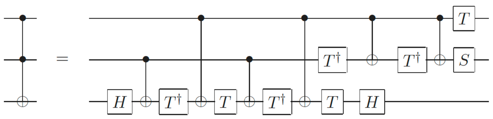
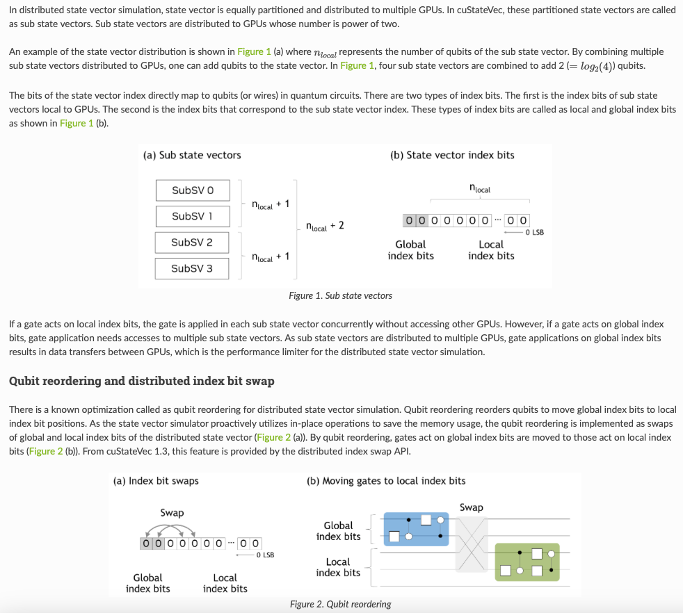

# Lecture 2 - Quantum statevector simulation on HPC


## Table of contents 
- [1. Naive and index-based statevector simulation]("naive-and-index-based-simulation")
- [2. Parallel state vector simulation]("parallel-statevector-simulation")
    - [2.1 Example: Deucalion's ARM partition]("deucalions-arm-paritition-parallel)
    - [2.2 Example: Deucalion's x86 partition]("deucalions-x86-paritition-parallel)
- [3. Distributed statevector simulation]("distributed-statevector-simulation")
    - [3.1 Example: Deucalion's ARM partition]("deucalions-arm-paritition-distributed)
    - [3.2 Example: Deucalion's x86 partition]("deucalions-x86-paritition-distributed)

## 1. Naive and index-based statevector simulation <a name="naive-and-index-based-simulation"></a>

A quantum state can be represented as a $2^n$-dimensional complex vector, where $n$ is the number of qubits,

```math
|\psi\rangle = \sum_{i=0}^{2^n - 1} \alpha_i |i\rangle = \begin{pmatrix}
\alpha_0 \\
\alpha_1 \\
\vdots \\
\alpha_{2^n-1}
\end{pmatrix}
```

Statevector simulators store the quantum state in a dense vector of $2^n$ complex amplitudes $\alpha_i$. Recall the we need an amount of memory that grows exponentially with the number of qubits, $n$ as presented in Table 1 below.

<div align="center">
  <table>
    <thead>
      <tr>
        <th>Qubits n</th>
        <th>Memory (2^n × 16 Bytes)</th>
      </tr>
    </thead>
    <tbody>
      <tr><td>1</td><td>32 Bytes</td></tr>
      <tr><td>2</td><td>64 Bytes</td></tr>
      <tr><td>4</td><td>256 Bytes</td></tr>
      <tr><td>8</td><td>4 KB</td></tr>
      <tr><td>16</td><td>1 MB</td></tr>
      <tr><td>30</td><td>16 GB</td></tr>
      <tr><td>31</td><td>32 GB</td></tr>
      <tr><td>32</td><td>64 GB</td></tr>
      <tr><td>40</td><td>16 TB</td></tr>
    </tbody>
  </table>
  <p><em>Table 1: Quantum statevector simulation: Memory as a function of the number of qubits</em></p>
</div>

A quantum state is manipulated in general by a $2^n \times 2^n$ unitary and complex matrix $U$, which acts on the state as follows:

```math
|\psi'\rangle = U |\psi\rangle = \begin{pmatrix}
u_{00} & u_{01} & \cdots & u_{0,2^n-1} \\
u_{10} & u_{11} & \cdots & u_{1,2^n-1} \\
\vdots & \vdots & \ddots & \vdots \\
u_{2^n-1,0} & u_{2^n-1,1} & \cdots & u_{2^n-1,2^n-1}
\end{pmatrix}
\begin{pmatrix}
\alpha_0 \\
\alpha_1 \\
\vdots \\
\alpha_{2^n-1}  
\end{pmatrix}
```

Statevector simulation is the process of applying a quantum circuit to a quantum state, which can be represented as a sequence matrix vector multiplications. However, the matrix multiplication is not performed directly on the $2^n \times 2^n$ matrix, but rather decomposed into a sequence of 1- and 2-qubit gates, which are applied to the state vector and gates are applied by modifying the state vector in-place, based on the linear transformation induced by the gate. This happens because universal quantum computation is achieved with a set of 1- and 2-qubit gates, for instance the Clifford+T gate set {H, CNOT, S, T}. Figure 1 below depicts the decomposition of the 3-qubit Toffoli gate into a sequence of 1- and 2-qubit gates.

<div align="center">
  
  <br>
  <em>Figure 1: Toffoli gate decomposition in 1 and 2 qubit gates</em>
</div>

That means that to understand statevector simulation, we solely need to understand how to apply 1- and 2-qubit gates to a quantum state. 

Let us consider an example of a 1-qubit gate in a two qubit state. Consider the Hadamard gate $H$ acting on the least significant qubit of the state $|00\rangle$. Naively, we would write the overall matrix vector operation as, 

```math
(I \otimes H) |00\rangle = \begin{pmatrix}
1 & 0 \\
0 & 1
\end{pmatrix} \otimes \begin{pmatrix}
\frac{1}{\sqrt{2}} & \frac{1}{\sqrt{

2}} \\
\frac{1}{\sqrt{2}} & -\frac{1}{\sqrt{2}}
\end{pmatrix} \begin{pmatrix}
1 \\
0 \\
0 \\
0
\end{pmatrix} = \begin{pmatrix}
\frac{1}{\sqrt{2}} & \frac{1}{\sqrt{2}} & 0 & 0 \\
\frac{1}{\sqrt{2}} & -\frac{1}{\sqrt{2}} & 0 & 0 \\
0 & 0 & \frac{1}{\sqrt{2}} & \frac{1}{\sqrt{2}} \\
0 & 0 & \frac{1}{\sqrt{2}} & -\frac{1}{\sqrt{2}}
\end{pmatrix} \begin{pmatrix}
1 \\
0 \\
0 \\
0
\end{pmatrix} = \begin{pmatrix}
\frac{1}{\sqrt{2}} \\
\frac{1}{\sqrt{2}} \\
0 \\
0
\end{pmatrix}
```

A naive application of a quantum gate would require creating a $2^n \times 2^n$ matrix representing the gate's action on all qubits, and multiplying it with the $2^n$-sized state vector. But this is not feasible because:

- The full matrix grows **exponentially** in both space and time.
- For large $n$, it becomes **intractable** to store and compute.

**Instead**, we exploit the fact that quantum gates are **local** — they act only on 1 or 2 qubits at a time. Therefore, we can compute their effect by updating only **small groups of amplitudes**.

A single-qubit gate $U$ acts on a particular qubit $q$, only those amplitudes whose indices differ **only at bit $q$** are affected.

Let’s denote:

- Index $i$ as the binary representation of the basis state.
- Bit  $q$ refers to qubit  $q$ in the binary string.

To apply a gate to qubit $q$, we loop over all indices $i$ such that bit $q$ is 0, and compute the index $j = i \oplus (1 \ll q)$, which flips bit $q$. Then we apply the gate $U$ is applied to the pair of amplitudes $(\alpha_i, \alpha_j)$ as follows:

```math
\begin{bmatrix}
\alpha_i' \\ \alpha_j'
\end{bmatrix}
=
U
\begin{bmatrix}
\alpha_i \\ \alpha_j
\end{bmatrix}
```

This **2x2 matrix multiplication** is done for each pair $(i, j)$, allowing us to simulate gate effects efficiently without constructing the full matrix.

---

Let us consider again the Hadamard gate $H$ acting on the least significant bit (qubit 0) of a 2-qubit state.

```math
\begin{bmatrix}\alpha_0 \\ \alpha_1 \\ \alpha_2 \\ \alpha_3\end{bmatrix} = \begin{bmatrix}1 \\ 0 \\ 0 \\ 0\end{bmatrix}
```

🔹 Binary Index Mapping

| Index | Amplitude | Binary | Qubit 1 | Qubit 0 |
|-------|-----------|--------|---------|---------|
| 0     | $\alpha_0 = 1$ | 00     | 0       | 0       |
| 1     | $\alpha_1 = 0$ | 01     | 0       | 1       |
| 2     | $\alpha_2 = 0$ | 10     | 1       | 0       |
| 3     | $\alpha_3 = 0$ | 11     | 1       | 1       |

🔹 Pair Construction

We apply a Hadamard gate to **qubit 0**, so we find all index pairs differing at bit 0 which are the pairs (0, 1) and (2, 3).

🔹 Apply Hadamard Matrix to each pair

Apply to (0, 1):

```math
\begin{bmatrix}
\alpha_0' \\ \alpha_1'
\end{bmatrix}
= H
\begin{bmatrix}
\alpha_0 \\ \alpha_1
\end{bmatrix}
= H
\begin{bmatrix}
1 \\ 0
\end{bmatrix}
=
\begin{bmatrix} \frac{1}{\sqrt{2}} \\ \frac{1}{\sqrt{2}} \end{bmatrix}
```

(2, 3) are both 0 → unchanged.

```math
\begin{bmatrix}
\alpha_2' \\ \alpha_3'
\end{bmatrix}
= H
\begin{bmatrix}
0 \\ 0
\end{bmatrix}
=
\begin{bmatrix} 0 \\ 0 \end{bmatrix}
```

🔹 Merge pairs to get the final State

```math
\begin{bmatrix}
\alpha_0' \\ \alpha_1' \\ \alpha_2' \\ \alpha_3'
\end{bmatrix}
=
\begin{bmatrix}
\frac{1}{\sqrt{2}} \\ \frac{1}{\sqrt{2}} \\ 0 \\ 0
\end{bmatrix}
```

---

>**1-qubit gate generalization to  n-qubit States**
>
>In general, applying a 1-qubit gate U on the q-th qubit of an n-qubit state vector is represented as repetitive multiplications of the unitary matrix and two-element vectors of probability amplitudes whose indices differ in the q-th bits of their binary index:
>
>$$
\binom{a_{* \ldots * 0_q * \ldots *}^{\prime}}{a_{* \ldots * 1_q * \ldots *}^{\prime}}=\left(\begin{array}{cc}
U_{00} & U_{01} \\
U_{10} & U_{11}
\end{array}\right)\binom{a_{* \ldots * 0_q * \ldots *}}{a_{* \ldots * 1_q * \ldots *}}
>$$
>There are $2^{n-1}$ such pairs, and the gate is applied to each pair in a loop.

A two-qubit gate changes only amplitudes whose basis indices differ only at bits $q$ and $r$.  
Thus the $2^n$ amplitudes decompose into disjoint quadruples (groups of 4) of the form

$$
\big(\alpha_{i_{00}},\,\alpha_{i_{01}},\,\alpha_{i_{10}},\,\alpha_{i_{11}}\big),
$$

There are exactly
$
\frac{2^n}{4}=2^{n-2}
$
such quadruples.

*Intuition:* for 1-qubit gates you updated $2^{n-1}$ pairs via a $2\times2$ multiply; for 2-qubit gates you update $2^{n-2}$ quadruples via a $4\times4$ multiply.

---
## 2. Parallel state vector simulation <a name="parallel-statevector-simulation"></a>

When you apply a gate to an n-qubit state vector $\boldsymbol{a}\in \mathbb{C}^{2^n}$, you never multiply a giant $2^n\times 2^n$ matrix. Instead, you update many independent chunks—tiny matrix–vector multiplies—in place:
	•	1-qubit gate $U\in\mathbb{C}^{2\times2}$ → $2^{n-1}$ pairs $(a_{i_0},a_{i_1})$.
Each chunk does one $2\times2$ multiply.
	•	2-qubit gate $V\in\mathbb{C}^{4\times4}$ → $2^{n-2}$ 4-tuples $(a_{i_{00}},a_{i_{01}},a_{i_{10}},a_{i_{11}})$.
Each chunk does one $4\times4$ multiply.

These chunks can be processed sequentially (one thread) or in parallel (many threads), because they touch disjoint indices.

🔹 **Parallel work: how many threads can you use?**

Two limits:

1.	Parallel work units. For a k-qubit gate on n qubits you have $W = 2^{\,n-k}$ independent chunks. You cannot usefully employ more than W threads on that gate.
2.	Memory bandwidth. State-vector updates are bandwidth-bound (few flops, many bytes). Speedup rises with threads until the node’s memory bandwidth is saturated; beyond that, extra threads don’t help.

Examples:
- $n=3$, 2-qubit gate → $W=2$: up to 2 threads useful.
- $n=4$, 2-qubit gate → $W=4$: up to 4 threads useful.
- $n=26$, 2-qubit gate → $W=2^{24}$: plenty of work; 48 cores can be kept busy until bandwidth caps you (strong but sub-linear scaling).

🔹 **Choosing the thread count T**

Algorithmic upper bound per $k$-qubit gate on $n$-qubit states is given by the number of independent chunks $W = 2^{n-k}$ constrained by the hardware threads available on the node.

```math
T = \min\!\big(2^{\,n-k},\ \text{hardware threads}\big).
```

If $2^{n-k}< \text{hardware threads}$ (e.g., small n), you simply don’t have enough chunks to keep all threads busy.

---
🔹 **Example: Deucalion's ARM partition**

- 1632 nodes with 48-core A64FX chips.
- Each compute core can handle one thread, resulting in a total of 48 threads per chip.
- Each node has 32 GB HBM2 RAM. Therefore the partition has 52TB of RAM in total.

>From Table 1 we see that a single ARM compute node can efficiently store and safely manipulate quantum states up to 30 qubits ($16*2^{30}=16$GB - conservative safe capacity per node that leaves room for workspace and OS). For larger quantum states, we need to distribute the state across multiple nodes (see Section 3).

 How can we schedule the number of threads on a single-node as a function of the number of qubits?


>**ARM node:** 48-core (one thread per core).  
>**Rule:** Optimal threads $T^*=\min(48,\;2^{\,n-k})$ for a $k$-qubit gate on $n$ qubits.

| Qubits $n$ | 1-qubit gate $T^*$ | 2-qubit gate $T^*$ |
|---:|---:|---:|
| 2 | 2 | 1 |
| 3 | 4 | 2 |
| 4 | 8 | 4 |
| 5 | 16 | 8 |
| 6 | 32 | 16 |
| 7 | 48 | 32 |
| 8 | 48 | 48 |

Beyond 8 qubits, we cannot usefully employ more than 48 threads on a single ARM node, because the number of independent chunks $W$ is larger than the number of threads available.

🔹 **Example: Deucalion's x86 partition**

- 500 nodes with 2 x AMD EPYC 7742 processors with 64 cores.
- Each compute core can handle one thread, resulting in a total of 128 threads per node.
- Each node has 256GB RAM. Therefore the partition has 128TB of RAM in total.

>From Table 1 we see that a single x86 compute node can efficiently store and safely manipulate quantum states up to 33 qubits ($16*2^{33}=128$GB - conservative safe capacity per node that leaves room for workspace and OS). For larger quantum states, we need to distribute the state across multiple nodes (see Section 3).

How can we schedule the number of threads on a single-node as a function of the number of qubits?

>**x86 node:** 128-core (one thread per core).  
>**Rule:** Optimal threads $T^*=\min(128,\;2^{\,n-k})$ for a $k$-qubit gate on $n$ qubits.

| Qubits \(n\) | 1-qubit gate \(T^*\) | 2-qubit gate \(T^*\) |
|---:|---:|---:|
| 2 | 2 | 1 |
| 3 | 4 | 2 |
| 4 | 8 | 4 |
| 5 | 16 | 8 |
| 6 | 32 | 16 |
| 7 | 64 | 32 |
| 8 | 128 | 64 |
| 9 | 128 | 128 |

Beyond 9 qubits, we cannot usefully employ more than 128 threads on a single x86 node, because the number of independent chunks \(W\) is larger than the number of threads available.

---

## 3. Distributed statevector simulation <a name="distributed-statevector-simulation"></a>

This section explains **how** a statevector is distributed across several nodes, then introduces **MPI ranks** and the notions of **local** and **global** qubits, and finally gives concrete **node-count tables** for Deucalion’s ARM and x86 partitions as examples.

---

An $n$-qubit state is a length-$2^n$ complex vector
$$
|\psi\rangle=\sum_{x=0}^{2^n-1}\alpha_x |x\rangle,\quad \alpha_x\in\mathbb C.
$$

With **distributed simulation**, we split this vector across $R$ processes so that **each process stores a disjoint slice**:

$$
\text{amps per process}=\frac{2^n}{R},\qquad
\text{bytes per process}=\frac{16\cdot 2^n}{R}\ \ \text{(complex128)}.
$$

A convenient way to view this is **bit slicing**. Let $r=\log_2 R$. We designate the **top $r$ index bits** as **distributed** (also called *global*), and the remaining $n-r$ as **local**. An amplitude index $x_{n-1}\dots x_1x_0$ belongs to the process whose rank ID equals the integer value of the **global** bits $x_{n-1}\dots x_{n-r}$. Inside that process, the **local** bits $x_{n-r-1}\dots x_0$ address the element within its slice.

- **Gate on local qubits only:** every process updates its own slice; **no communication**.
- **Gate that touches any global qubit:** processes must **exchange** the affected portions of their slices (pairwise or small all-to-alls), apply the small $2^k\times 2^k$ kernel, then (optionally) swap back.

This preserves the same “tiny mat–vec on pairs/4-tuples” model as single-node simulation; we just add **data exchanges** when a targeted qubit lives among the **global** bits.

---

🔹 **Tiny statevector examples**

**Example A — 3 qubits, $R=2$ processes ($r=1$ global bit).**  
State has 8 amplitudes $a[0..7]$. Let the **MSB** $x_2$ be global.

- **Rank 0** (MSB=0) holds indices $\{0,1,2,3\}$.  
- **Rank 1** (MSB=1) holds indices $\{4,5,6,7\}$.

1) Apply **$H$** on **qubit 0** (LSB, local): pairs are $(0,1),(2,3)$ on rank 0 and $(4,5),(6,7)$ on rank 1. Each rank updates *in place*; **no messages**.

2) Apply **$H$** on **qubit 2** (MSB, global): pairs are $(0,4),(1,5),(2,6),(3,7)$, which straddle ranks. Each rank exchanges half its slice with its partner (rank $\oplus 1$), applies four $2\times2$ multiplies on the received+resident halves, then writes back. **One exchange round** is needed.

---

**Example B — 4 qubits, $R=4$ processes ($r=2$ global bits).**  
State has 16 amplitudes $a[0..15]$. Let top two bits $x_3x_2$ be global.

- **Rank 0 (00):** $\{0..3\}$  
- **Rank 1 (01):** $\{4..7\}$  
- **Rank 2 (10):** $\{8..11\}$  
- **Rank 3 (11):** $\{12..15\}$

- Gate on $(q_0,q_1)$ (both local): each rank applies one $4\times4$ per local 4-tuple; **no comm**.  
- Gate on $(q_1,q_3)$ with $q_3$ global: ranks pair up along the $q_3$-dimension to exchange the needed quarters, apply the $4\times4$, then (optionally) swap back → **one exchange dimension**.  
- Gate on two **different** global bits (e.g., $q_2$ and $q_3$): you communicate along two dimensions or use a subgroup all-to-all → **heavier comm**.

---

🔹 **3.3 What are processes, MPI, and MPI ranks?**

- **Process / task:** an OS program instance with its own address space.  
- **MPI (Message Passing Interface):** the standard API for processes to communicate across nodes.  
- **MPI rank:** the ID of a process within an MPI job $\{0,\dots,R-1\}$. In distributed simulation, **each rank stores a slice** of the state and participates in exchanges whenever a gate touches **global qubits**.

> Practical tip: many simulators support **qubit reordering** (swap a global bit with a local one) so upcoming gates hit local qubits, reducing communication. Here is the excerpt from the [Nvidia CuStateVec simulator](https://docs.nvidia.com/cuda/cuquantum/latest/custatevec/distributed-index-bit-swap.html#distributed-state-vector-simulation):
>
> <p align="center">

<em>Figure 2: Distributed state vector simulation with qubit reordering from Nvidia CuStateVec simulator.</em>
</p>

---

🔹 **How many nodes (ranks) do I need? Sizing to 40 qubits**

We size by **memory first**. With double precision, the state size is $16\cdot 2^n$ bytes. For safety we reserve room for workspace/OS, using a **per-node safe state capacity**:

- **Deucalion ARM (A64FX, 32 GiB HBM2/node):** use **16 GiB** per node as “safe” for the state.  
- **Deucalion x86 (2× EPYC 7742, 256 GiB DRAM/node):** use **128 GiB** per node as “safe”.

Assume **1 rank per node**. Choose the **smallest power-of-two $R$** such that

```math
\frac{16\cdot 2^n}{R}\le \text{safe bytes per node}.
```

#### 3.1 ARM partition (A64FX, safe ≈ 16 GiB per node) <a name="deucalions-arm-paritition-distributed"></a> 

| Qubits $n$ | State size | Nodes $R$ (min $2^r$) | Per-rank state |
|---:|---:|---:|---:|
| 30 | 16 GiB | 1 | 16 GiB |
| 31 | 32 GiB | 2 | 16 GiB |
| 32 | 64 GiB | 4 | 16 GiB |
| 33 | 128 GiB | 8 | 16 GiB |
| 34 | 256 GiB | 16 | 16 GiB |
| 35 | 512 GiB | 32 | 16 GiB |
| 36 | 1 TiB | 64 | 16 GiB |
| 37 | 2 TiB | 128 | 16 GiB |
| 38 | 4 TiB | 256 | 16 GiB |
| 39 | 8 TiB | 512 | 16 GiB |
| 40 | 16 TiB | 1024 | 16 GiB |

#### 3.2 x86 partition (256 GiB/node, safe ≈ 128 GiB per node) <a name="deucalions-x86-paritition-distributed"></a>

| Qubits $n$ | State size | Nodes $R$ (min $2^r$) | Per-rank state |
|---:|---:|---:|---:|
| 33 | 128 GiB | 1 | 128 GiB |
| 34 | 256 GiB | 2 | 128 GiB |
| 35 | 512 GiB | 4 | 128 GiB |
| 36 | 1 TiB | 8 | 128 GiB |
| 37 | 2 TiB | 16 | 128 GiB |
| 38 | 4 TiB | 32 | 128 GiB |
| 39 | 8 TiB | 64 | 128 GiB |
| 40 | 16 TiB | 128 | 128 GiB |
| 41 | 32 TiB | 256 | 128 GiB |
| 42 | 64 TiB | 512 | 128 GiB |

*(x86 partition has 500 nodes total; up to $n=41$ fits comfortably.)*

> **Inside each rank**, keep the single-node threading rule on the **local** problem size: for a $k$-qubit gate,
> 
> $T^*_{\text{rank}}\approx \min\big(\text{cores per rank},\ 2^{\,n-r-k}\big)$
> 
> and expect speedup to plateau at the node’s **memory bandwidth**. 


### References

- [mpiQulacs: A Distributed Quantum Computer Simulator for A64FX-based Cluster Systems](https://arxiv.org/abs/2203.16044)
- [NVIDIA cuStateVec overview](https://docs.nvidia.com/cuda/cuquantum/latest/custatevec/overview.html#multi-gpu-computation)
