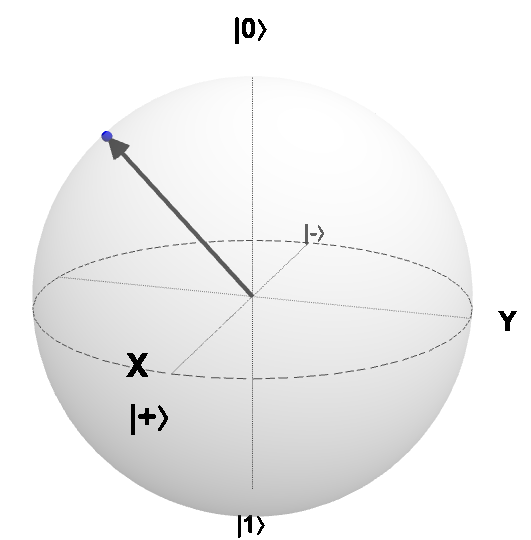
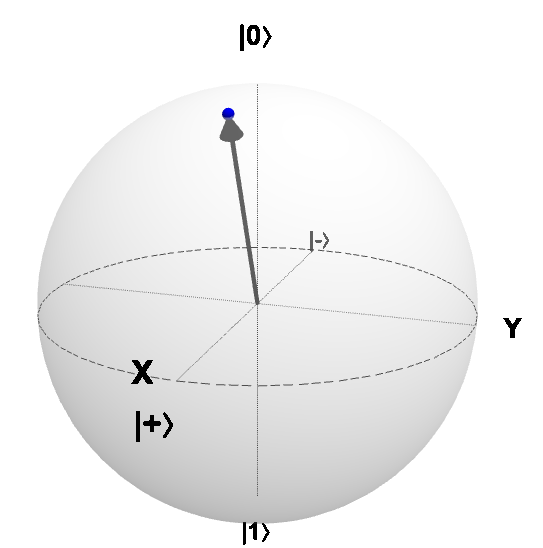
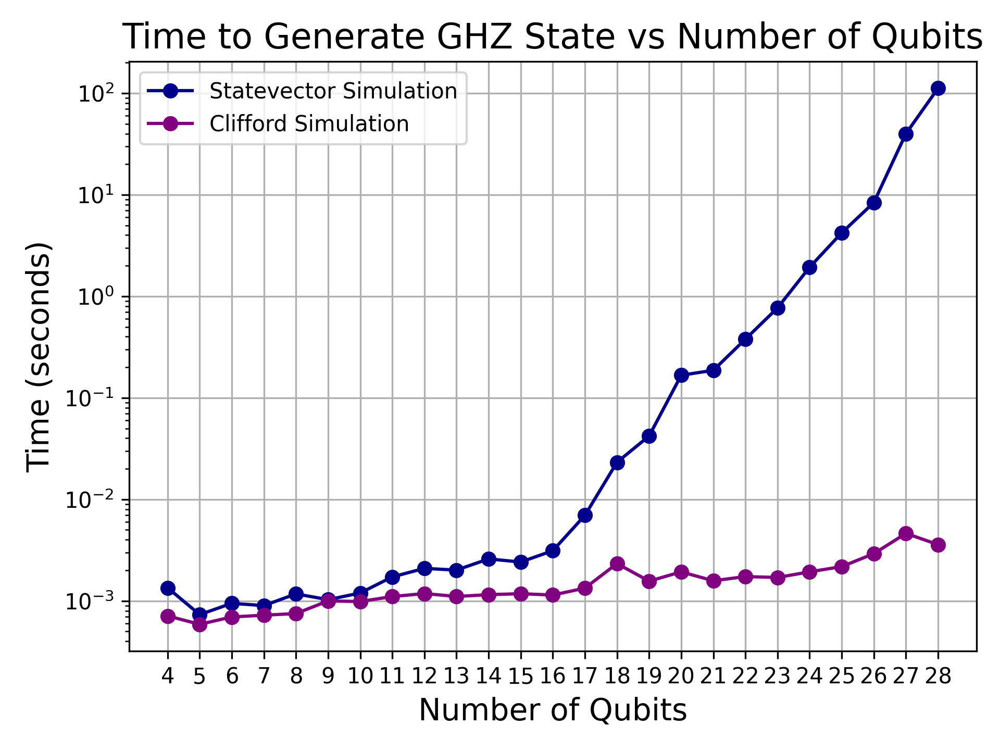

# High Performance Computing for Quantum Simulation


In this tutorial, we will explore the language of linear algebra, focusing on vectors and matrices, and utilize Qulacs for simulating and visualizing quantum processes. We will discuss various quantum simulators, delve into the theory of classical efficient simulation of quantum computation, and highlight the current emphasis on the Schrödinger state vector simulation framework, which is the predominant method in quantum computing. Additionally, we will address the necessity for high-performance computing (HPC) systems to simulate quantum phenomena at scale.

## 1. Qubits and state vectors

The *qubit* is the unit of information in a quantum computer. In a quantum computing system the qubit can be in a definite state 0 or 1 behaving as standard classical computer. In vector form, qubits represent our computational basis, usually represented as, 
$$|0\rangle = (1 \ 0) \quad ; \quad|1\rangle = (0 \ 1)$$
While the qubit can be in a definite classical state, it can also be a linear combination of both states - also known as a *superposition state*: 
$$
|\psi \rangle = \alpha |0 \rangle + \beta |1\rangle = \alpha (1 \ 0) + \beta (0 \ 1) = (\alpha \ \beta)
$$
where the qubit can be in a mixture of both 0 and 1 with *probability amplitudes*  $\alpha$ and $\beta$ , respectively. 
>**Note**: This does not mean that the qubit is in either state with some probability and it just so happens that we do not know which - a qubit is not a probabilistic bit !! At the subatomic level, both states physically happen at the same time. Crucially, it encompasses classical probability theory because $\alpha$ and $\beta$  are complex numbers. These are complex to sustain the axioms of quantum theory as quantum states live in a complex Hilbert space.  Once the qubit is measured, it results in *superposition collapse* , returning again one classical bit of information with probabilities such that  $|\alpha|^2 + |\beta|^2 = 1$ 

```
from qulacs import QuantumState

# Generate 2 qubit states

n = 1

state = QuantumState(n)

print(state)
```
```
*** Quantum State *** 
* Qubit Count : 1 
* Dimension : 2 
* State vector : (1,0) (0,0)
```

The superposition is a powerful feature of quantum computers since with $n$ qubits we can represent every $2^n$ possible values simultaneously. 

>**NOTE:** Quantum superposition alone does not provide advantage at all. Because it depends on how we actually measure the system and retrieve classical information of interest. To understand that we need to introduce *quantum gates* - more on that later.

What if we use a classical computer to represent qubits ? The state vector of a qubit is represented by two complex numbers $(\alpha \quad \beta)$. You would typically require 8 bytes in double precision to represent both the real and complex parts of each complex amplitude. Therefore, as one qubit requires 16 bytes, $n$ qubits would need $2^n \times 16$  bytes of memory. Table 1 represents the amount of memory necessary to store a quantum state vector as a function of the number of qubits, assuming **16 bytes per amplitude**. Binary units: KiB=1024 B, MiB=1024² B, GiB=1024³ B, TiB=1024⁴ B.

| Qubits | Bytes | KiB | MiB | GiB | TiB |
|---:|---:|---:|---:|---:|---:|
| 1 | 3.200000e+01 | 3.125000e-02 | 3.051758e-05 | 2.980232e-08 | 2.910383e-11 |
| 2 | 6.400000e+01 | 6.250000e-02 | 6.103516e-05 | 5.960464e-08 | 5.820766e-11 |
| 3 | 1.280000e+02 | 1.250000e-01 | 1.220703e-04 | 1.192093e-07 | 1.164153e-10 |
| 4 | 2.560000e+02 | 2.500000e-01 | 2.441406e-04 | 2.384186e-07 | 2.328306e-10 |
| 5 | 5.120000e+02 | 5.000000e-01 | 4.882812e-04 | 4.768372e-07 | 4.656613e-10 |
| 6 | 1.024000e+03 | 1.000000e+00 | 9.765625e-04 | 9.536743e-07 | 9.313226e-10 |
| 7 | 2.048000e+03 | 2.000000e+00 | 1.953125e-03 | 1.907349e-06 | 1.862645e-09 |
| 8 | 4.096000e+03 | 4.000000e+00 | 3.906250e-03 | 3.814697e-06 | 3.725290e-09 |
| 9 | 8.192000e+03 | 8.000000e+00 | 7.812500e-03 | 7.629395e-06 | 7.450581e-09 |
| 10 | 1.638400e+04 | 1.600000e+01 | 1.562500e-02 | 1.525879e-05 | 1.490116e-08 |
| 11 | 3.276800e+04 | 3.200000e+01 | 3.125000e-02 | 3.051758e-05 | 2.980232e-08 |
| 12 | 6.553600e+04 | 6.400000e+01 | 6.250000e-02 | 6.103516e-05 | 5.960464e-08 |
| 13 | 1.310720e+05 | 1.280000e+02 | 1.250000e-01 | 1.220703e-04 | 1.192093e-07 |
| 14 | 2.621440e+05 | 2.560000e+02 | 2.500000e-01 | 2.441406e-04 | 2.384186e-07 |
| 15 | 5.242880e+05 | 5.120000e+02 | 5.000000e-01 | 4.882812e-04 | 4.768372e-07 |
| 16 | 1.048576e+06 | 1.024000e+03 | 1.000000e+00 | 9.765625e-04 | 9.536743e-07 |
| 17 | 2.097152e+06 | 2.048000e+03 | 2.000000e+00 | 1.953125e-03 | 1.907349e-06 |
| 18 | 4.194304e+06 | 4.096000e+03 | 4.000000e+00 | 3.906250e-03 | 3.814697e-06 |
| 19 | 8.388608e+06 | 8.192000e+03 | 8.000000e+00 | 7.812500e-03 | 7.629395e-06 |
| 20 | 1.677722e+07 | 1.638400e+04 | 1.600000e+01 | 1.562500e-02 | 1.525879e-05 |
| 21 | 3.355443e+07 | 3.276800e+04 | 3.200000e+01 | 3.125000e-02 | 3.051758e-05 |
| 22 | 6.710886e+07 | 6.553600e+04 | 6.400000e+01 | 6.250000e-02 | 6.103516e-05 |
| 23 | 1.342177e+08 | 1.310720e+05 | 1.280000e+02 | 1.250000e-01 | 1.220703e-04 |
| 24 | 2.684355e+08 | 2.621440e+05 | 2.560000e+02 | 2.500000e-01 | 2.441406e-04 |
| 25 | 5.368709e+08 | 5.242880e+05 | 5.120000e+02 | 5.000000e-01 | 4.882812e-04 |
| 26 | 1.073742e+09 | 1.048576e+06 | 1.024000e+03 | 1.000000e+00 | 9.765625e-04 |
| 27 | 2.147484e+09 | 2.097152e+06 | 2.048000e+03 | 2.000000e+00 | 1.953125e-03 |
| 28 | 4.294967e+09 | 4.194304e+06 | 4.096000e+03 | 4.000000e+00 | 3.906250e-03 |
| 29 | 8.589935e+09 | 8.388608e+06 | 8.192000e+03 | 8.000000e+00 | 7.812500e-03 |
| 30 | 1.717987e+10 | 1.677722e+07 | 1.638400e+04 | 1.600000e+01 | 1.562500e-02 |
| 31 | 3.435974e+10 | 3.355443e+07 | 3.276800e+04 | 3.200000e+01 | 3.125000e-02 |
| 32 | 6.871948e+10 | 6.710886e+07 | 6.553600e+04 | 6.400000e+01 | 6.250000e-02 |
| 33 | 1.374390e+11 | 1.342177e+08 | 1.310720e+05 | 1.280000e+02 | 1.250000e-01 |
| 34 | 2.748779e+11 | 2.684355e+08 | 2.621440e+05 | 2.560000e+02 | 2.500000e-01 |
| 35 | 5.497558e+11 | 5.368709e+08 | 5.242880e+05 | 5.120000e+02 | 5.000000e-01 |
| 36 | 1.099512e+12 | 1.073742e+09 | 1.048576e+06 | 1.024000e+03 | 1.000000e+00 |
| 37 | 2.199023e+12 | 2.147484e+09 | 2.097152e+06 | 2.048000e+03 | 2.000000e+00 |
| 38 | 4.398047e+12 | 4.294967e+09 | 4.194304e+06 | 4.096000e+03 | 4.000000e+00 |
| 39 | 8.796093e+12 | 8.589935e+09 | 8.388608e+06 | 8.192000e+03 | 8.000000e+00 |
| 40 | 1.759219e+13 | 1.717987e+10 | 1.677722e+07 | 1.638400e+04 | 1.600000e+01 |


As we can see, the amount of memory grows exponentially with the number of qubits. For example, to store a quantum state of 30 qubits, one needs 16GB of memory - the memory of a regular laptop. For 40 qubits one already needs 16TB. Therefore, in the absence of real quantum hardware, to simulate quantum phenomena we need to use HPC systems *where memory can be distributed across several computing processing units*. 

## 2. Single-qubit gates

Qubits are manipulated with unitary operations called *gates* similar to classical logical circuits. Single-qubit operations are 2x2 complex unitary matrices. *Pauli matrices* are the most common single-qubit gates, which are defined as follows:
$$
X = \begin{pmatrix}
0 & 1 \\
1 & 0
\end{pmatrix} \quad ; \quad
Y = \begin{pmatrix}
0 & -i \\
i & 0
\end{pmatrix} \quad ; \quad
Z = \begin{pmatrix}
1 & 0 \\
0 & -1
\end{pmatrix}
$$
Since a qubit is a vector in a 2-dimensional complex vector space, the Pauli matrices are unitary matrices that can be used to manipulate the qubit state as they are the generators of rotations around the axes of the Bloch sphere.
For example, the Pauli-X gate flips the state of a qubit, i.e. $X |0\rangle = |1\rangle$ and $X |1\rangle = |0\rangle$ and the Rx gate rotates the qubit around the x-axis of the Bloch sphere by an angle $\theta$,
$$
R_x(\theta) = e^{-i \theta X / 2} =
\cos(\theta/2) I - i \sin(\theta/2) X = \begin{pmatrix}
\cos(\theta/2) & -i \sin(\theta/2) \\
-i \sin(\theta/2) & \cos(\theta/2)
\end{pmatrix}
$$

<p align="center">

</p>

The Y gate flips the state of a qubit with a complex phase shift, i.e. $Y |0\rangle = i |1\rangle$ and $Y |1\rangle = -i |0\rangle$. The Ry gate rotates the qubit around the y-axis of the Bloch sphere by an angle $\theta$,
$$
R_y(\theta) = e^{-i \theta Y / 2} =
\cos(\theta/2) I - i \sin(\theta/2) Y =
\begin{pmatrix}
\cos(\theta/2) & -\sin(\theta/2) \\
\sin(\theta/2) & \cos(\theta/2)
\end{pmatrix}
$$
<p align="center">

</p>
The Z gate applies a phase shift to the state of a qubit, i.e. $Z |0\rangle = |0\rangle$ and $Z |1\rangle = -|1\rangle$. The Rz gate rotates the qubit around the z-axis of the Bloch sphere by an angle $\theta$, leaving the state unchanged in the x-y plane,
$$
R_z(\theta) = e^{-i \theta Z / 2} =
\begin{pmatrix}
e^{-i \theta/2} & 0 \\
0 & e^{i \theta/2}
\end{pmatrix}
$$     
<p align="center">

</p> 
The Hadamard gate is a special single-qubit gate that creates a superposition state from a definite state. It is defined as follows:
The *Hadamard* gate is one fundamental operation that creates the uniform superposition state over two qubits :

$$
H = \frac{1}{\sqrt{2}} \begin{pmatrix}
1 & 1 \\
1 & -1
\end{pmatrix}
$$

$$
H |0\rangle = \frac{1}{\sqrt{2}}|0\rangle + \frac{1}{\sqrt{2}}|1\rangle = (\frac{1}{\sqrt{2}} \quad \frac{1}{\sqrt{2}})
$$
<p align="center">

</p> 
If we apply the Hadamard gate to $n$ qubits individually, we can create a uniform superposition state over all $2^n$ possible states,
$$
H^{\otimes n} |0\rangle^{\otimes n} = \frac{1}{\sqrt{2^n}} \sum_{x=0}^{2^n-1} |x\rangle
$$
As an example, the 3-qubit uniform superposition state is given by

$$
H^{\otimes 3} |0\rangle^{\otimes 3} = \frac{1}{\sqrt{8}} (|000\rangle + |001\rangle + |010\rangle + |011\rangle + |100\rangle + |101\rangle + |110\rangle + |111\rangle)
$$

```
from qulacs import QuantumCircuit
from qulacsvis import circuit_drawer

# Generate n qubit states
n = 3

# apply hadamard gate to state
circuit = QuantumCircuit(n)
for i in range(n):
    circuit.add_H_gate(i)

# display quantum circuit
circuit_drawer(circuit, 'mpl')
```


```
*** Quantum State ***
 * Qubit Count : 3
 * Dimension   : 8
 * State vector : 
(0.353553,0)
(0.353553,0)
(0.353553,0)
(0.353553,0)
(0.353553,0)
(0.353553,0)
(0.353553,0)
(0.353553,0)
```

If we were to measure the state after applying the Hadamard gate to $n$ qubits, we would get one of the $2^n$ states with *equal probability*. Therefore, to get to "quantum advantage", we need to manipulate the superposition, i.e. the amplitudes of the states, in such a way that we can retrieve the classical information of interest either with high probability or deterministically. One way of achieving this is through *quantum interference* - a phenomenon where the amplitudes of certain states can be amplified while others are suppressed.

Hadamard gates are one the gates that can cause interference. For example, suppose we create the uniform superposition over two qubits, perform a phase shift and then apply another Hadamard gate,
$$
H Z H |0\rangle = \frac{1}{\sqrt{2}} \begin{pmatrix}
1 & 1 \\
1 & -1
\end{pmatrix}
\frac{1}{\sqrt{2}} \begin{pmatrix}
1 & 0 \\
0 & -1
\end{pmatrix}
\frac{1}{\sqrt{2}} \begin{pmatrix}
1 & 1 \\
1 & -1
\end{pmatrix}
|0\rangle = (0 \ 1) = |1\rangle
$$
we collapsed the superposition to a definite state $|1\rangle$ with probability 1.

```

# Generate 3 qubit uniform superposition state
n=1

#apply hadamard gate to state 
circuit = QuantumCircuit(n)
circuit.add_H_gate(0)
circuit.add_Z_gate(0)
circuit.add_H_gate(0)

#display quantum circuit
circuit_drawer(circuit, 'mpl')

# Apply the circuit to the state
state = QuantumState(n)
circuit.update_quantum_state(state)
print(state)
```


```
 *** Quantum State ***
 * Qubit Count : 1
 * Dimension   : 2
 * State vector : 
(0,0)
(1,0)
```


>**NOTE**: Schrodinger type simulators have a dense $2^n$ statevector and iteratively apply quantum gates to the state vector ,via matrix-vector multiplication, updating it at each step. However, not every quantum circuit requires all $2^n$ amplitudes to be tracked. For instance, quantum states constructed by single-qubit gates as presented above are *classically easy to simulate*. These prepare separable or *unentangled* states which means that the overal quantum state can be written as a tensor product of individual qubit states. For example, the 3-qubit uniform superposition state can be written as
>$$
H^{\otimes 3} |0\rangle^{\otimes 3} = \bigotimes_{i=0}^{2} \frac{1}{\sqrt{2}} (|0\rangle + |1\rangle)
>$$
>Therefore, we just have to keep track of $2n$ amplitudes instead and the probability of measuring a particular state say $|000\rangle$ is given by the product of the probabilities of measuring each individual qubit,
>$$
P(000) = |\frac{1}{\sqrt{2}}|^2 \cdot |\frac{1}{\sqrt{2}}|^2 \cdot |\frac{1}{\sqrt{2}}|^2 = \frac{1}{8}
>$$

## 3. Multi-qubit gates

Entangled states can be created by applying multi-qubit gates, which are unitary matrices that act on multiple qubits simultaneously. The most common multi-qubit gate is the *CNOT* (Controlled-NOT) gate, which flips the state of a target qubit if the control qubit is in the state $|1\rangle$. The CNOT gate is defined as follows:
$$
CNOT = |0\rangle\langle 0| \otimes I + |1\rangle\langle 1| \otimes X =

\begin{pmatrix}
1 & 0 & 0 & 0 \\
0 & 1 & 0 & 0 \\
0 & 0 & 0 & 1 \\

0 & 0 & 1 & 0
\end{pmatrix}
$$
where $I$ is the identity matrix and $X$ is the Pauli-X gate. The CNOT gate creates entanglement between the control and target qubits, i.e. it creates a state that cannot be written as a tensor product of individual qubit states. For example, if we apply the CNOT gate controlled by the uniform superposition state to a qubit in the zero state, we get the *Bell state*,
$$
|\Phi^+\rangle = \frac{1}{\sqrt{2}} (|00\rangle + |11\rangle)
$$

```
from qulacs import QuantumCircuit, QuantumState
from qulacsvis import circuit_drawer

# Generate 2 qubit states for Bell state
n = 2

# apply hadamard gate to first qubit
circuit = QuantumCircuit(n)
circuit.add_H_gate(0)
# apply CNOT gate to first and second qubit
circuit.add_CNOT_gate(0, 1)

# display quantum circuit
circuit_drawer(circuit, 'mpl')

state = QuantumState(n)
circuit.update_quantum_state(state)
print(state)
```

```
*** Quantum State ***
 * Qubit Count : 2
 * Dimension   : 4
 * State vector : 
(0.707107,0)
       (0,0)
       (0,0)
(0.707107,0)
```
Bell states are a special class of entangled states that exhibit strong correlations between the qubits. They are used in many quantum algorithms and protocols, such as quantum teleportation and quantum key distribution. Bell states cannot be factorized into a tensor product of individual qubit states, i.e. they are *entangled* states which makes it even harder to simulate classically with a Schrodinger type statevector simulator.

>**NOTE**: Simulating 40 qubits with a Schrodinger type statevector simulator require 16 TB of memory (See Table 1). However, even though we had HPC system with a memory to say 100 qubits, it doesn't mean we would be able to simulate every quantum system, because the computing time will be, in general, **exponential** since we are simulating n-qubit gates that happen natively at the hardware level in an actual quantum computer. However, there is still circuit classes where classically efficient simulation is indeed possible in polynomial time such as *Clifford circuits* - composed of gates of the set {H, CNOT, S}.
>
>Bell states or in general n-qubit Greenberger-Horne-Zeilinger (GHZ) states, 
>$$
|GHZ\rangle = \frac{1}{\sqrt{2}} (|00...0\rangle + |11...1\rangle)
>$$
>are good examples of highly entangled states implemented by Clifford circuits as presented below.  

```
from qulacs import QuantumCircuit, QuantumState
from qulacsvis import circuit_drawer

# Generate 4 qubit GHZ state
n = 4

# apply hadamard gate to first qubit
circuit = QuantumCircuit(n)
circuit.add_H_gate(0)
for i in range(1, n):
    # apply CNOT gate to all other qubits
    circuit.add_CNOT_gate(0, i)
# display quantum circuit
circuit_drawer(circuit, 'mpl')

state = QuantumState(n)
circuit.update_quantum_state(state)
print(state)
```

```
*** Quantum State ***
 * Qubit Count : 4
 * Dimension   : 16
 * State vector : 
(0.707107,0)
       (0,0)
       (0,0)
       (0,0)
       (0,0)
       (0,0)
       (0,0)
       (0,0)
       (0,0)
       (0,0)
       (0,0)
       (0,0)
       (0,0)
       (0,0)
       (0,0)
(0.707107,0)
```
>These states are special because rather than tracking the state of the n-qubit system by storing and updating its $2^n$ complex amplitudes, one can instead track the system’s 
$n$ stabilizer generators using the *stabilizer tableau* (see https://pennylane.ai/qml/demos/tutorial_clifford_circuit_simulations). However, a simulator other than Schrodinger statevector is actually needed to efficiently simulate these circuits, as is the case of the *clifford simulators*. Below is depicted the execution time for GHZ state simulation with Schrodinger statevector simulator and Pennylane's Clifford simulator as a function of the number of qubits.

<p align="center">

</p> 

>Remarkably, Clifford circuits are not universal for quantum computation. Therefore, **entanglement is a necessary resource but not sufficient for both classical hardness and quantum computational advantage**.

Universal quantum computation can be achieved by adding a single non-Clifford gate to the set of Clifford gates. An example is the Cliffor+T gate set, which includes the T gate defined as follows:
$$
T = \begin{pmatrix}
1 & 0 \\
0 & e^{i \pi / 4}
\end{pmatrix}
$$
Therefore, T-gate count is one of the most important metrics for classical hardness. Indeed for small T count and entanglement *Tensor Network* simulators have great scaling (see https://pennylane.ai/qml/demos/tutorial_tn_circuits). However Large non-Clifford content or magic make these simulators scale roughly exponentially in the T-count. A linear (or even moderate) number of T gates is enough to make these methods blow up. Additionally, if the circuit scrambles across the device like in random circuits, deep Clifford+T, QAOA at higher depth, quantum volume, chaotic dynamics), tensor networks lose their advantage. In that regime, a dense Schrödinger statevector—despite its $\Theta(2^n)$ memory—often becomes the fastest practical option up to the memory ceiling, especially on GPUs and multi-node HPC. Why?
- **Data-parallelism** maps perfectly to hardware: every 1–2 qubit gate is a bulk stream over the $2^n$ amplitudes. That vectorized, embarrassingly parallel pattern saturates SIMD units, GPU SMs, and network bandwidth.
- **Predictable scaling**: runtime $\approx c \, m\, 2^n / \text{throughput}$. As you throw more cores/GPUs/nodes at it, you get near-linear speedups until communication dominates.
- **Mature kernels**: libraries like cuStateVec / Lightning / Qulacs / Aer have hand-tuned kernels (fusion, cache-blocking, coalesced I/O) that squeeze the last drop out of CPUs/GPUs.

>**Quantum simulator practical guidance**:
>- Clifford only (H, S, CNOT) + Pauli measurements $\rightarrow$ stabilizer (poly-time/mem).
>- Low entanglement / low treewidth / small T-count $\rightarrow$ tensor networks.
>- Large T-count + high entanglement (generic Clifford+T, random circuits, deep QAOA, quantum volume) $\rightarrow$ statevector on HPC 


### References
- [Qulacs Documentation](https://qulacs-doc.readthedocs.io/en/latest/)
- [Efficient Simulation of Clifford Circuits](https://pennylane.ai/qml/demos/tutorial_clifford_circuit_simulations)
- [Improved simulation of stabilizer circuits](https://pennylane.ai/qml/demos/tutorial_clifford_circuit_simulations)
- [Faster Schrödinger-style simulation of quantum circuits](https://arxiv.org/pdf/2008.00216)
- W. Huggins, P. Patil, B. Mitchell, K. B. Whaley, and E. M. Stoudenmire, Quantum Science and Technology 4, 024001 (2019), ISSN 2058-9565, URL http://dx.doi.org/10.1088/2058-9565/aaea94
- R. Orús, Annals of Physics 349, 117 (2014), ISSN 0003- 4916, URL https://www.sciencedirect.com/science/article/pii/S0003491614001596.