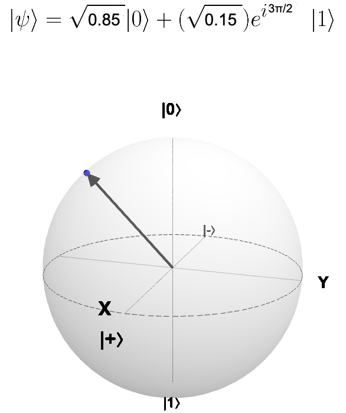
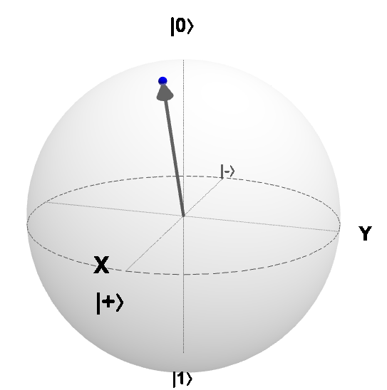
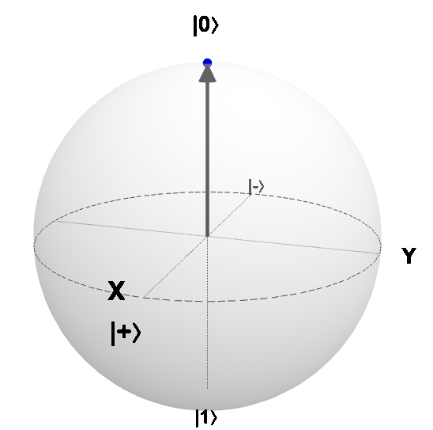
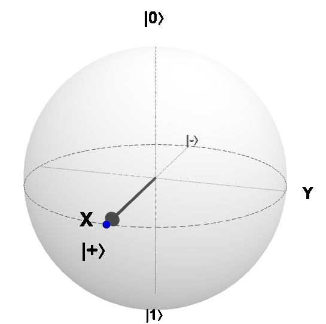
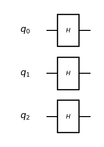
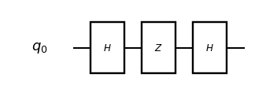
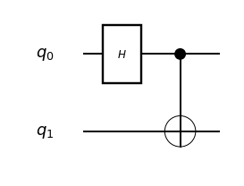
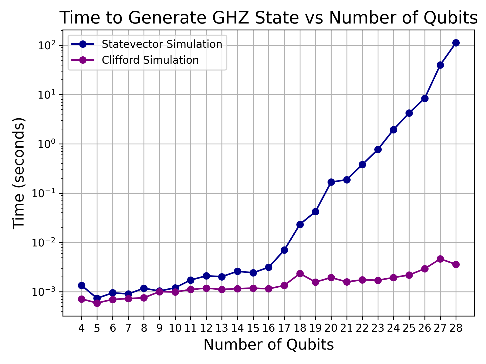

# Part 1 - Quantum Computing and classical simulation

- [Part 1 - Quantum Computing and classical simulation](#part-1---quantum-computing-and-classical-simulation)
  - [1. Qubits and state vectors ](#1-qubits-and-state-vectors-)
  - [2. Single-qubit gates ](#2-single-qubit-gates-)
  - [3. Multi-qubit gates ](#3-multi-qubit-gates-)
  - [4. References ](#4-references-)

Part 1 offers a compact introduction to quantum computing through the lens of linear algebra and Dirac notation, using Qulacs as our working quantum simulator. Here we provide small introductory examples in qulacs but the user should navigate to the [qulacs documentation](http://docs.qulacs.org/en/latest/index.html) for more in depth information about the quantum simulator and/or the [quantum native dojo](https://dojo.qulacs.org/en/latest/index.html) for more quantum computing tutorials and quantum algorithmic implementations.  

Qubits will be represented as vectors in complex Hilbert spaces, manipulated by unitary gates, and analyzed to illustrate phenomena such as interference and entanglement within a matrix-based framework. This section also introduces classical simulation—emphasizing statevector simulation—as a foundation for understanding the management of quantum statevectors in exponentially large spaces and the necessity of High Performance Computing (HPC) systems for scaling these simulations.

## 1. Qubits and state vectors <a id ="1-qubits-and-state-vectors-"></a>

The *qubit* is the unit of information in a quantum computer. In a quantum computing system the qubit can be in a definite state 0 or 1 behaving as standard classical computer. In vector form, qubits represent our computational basis, usually represented as, 

```math
|0\rangle = \begin{pmatrix}1\\0\end{pmatrix}
\quad ; \quad
|1\rangle = \begin{pmatrix}0\\1\end{pmatrix}
```

While the qubit can be in a definite classical state, it can also be a linear combination of both states - also known as a *superposition state*: 

```math
|\psi \rangle = \alpha |0 \rangle + \beta |1\rangle
= \alpha \begin{pmatrix}1\\0\end{pmatrix} + \beta \begin{pmatrix}0\\1\end{pmatrix} 
= \begin{pmatrix}\alpha\\\beta\end{pmatrix}
```

where the qubit can be in a mixture of both 0 and 1 with *probability amplitudes*  $\alpha$ and $\beta$ , respectively. 
>**NOTE**: This does not mean that the qubit is in either state with some probability and it just so happens that we do not know which - a qubit is not a probabilistic bit !! At the subatomic level, both states physically happen at the same time. Crucially, it encompasses classical probability theory because $\alpha$ and $\beta$  are complex numbers. These are complex to sustain the axioms of quantum theory as quantum states live in a complex Hilbert space.  Once the qubit is measured, it results in *superposition collapse* , returning again one classical bit of information with probabilities such that  $|\alpha|^2 + |\beta|^2 = 1$ 

In Qulacs we can create a quantum state and visualize its properties as follows: 

```python
from qulacs import QuantumState

# Generate a single-qubit n=1
n = 1

# Create quantum state
state = QuantumState(n)

print(state)
```

the script above creates a single qubit in the zero state and prints its properties:

```plaintext
*** Quantum State *** 
* Qubit Count : 1 
* Dimension : 2 
* State vector : (1,0) (0,0)
```

The superposition is a powerful feature of quantum computers since with $n$ qubits we can represent every $2^n$ possible values simultaneously. 

>**NOTE:** Quantum superposition alone does not provide advantage at all. Because it depends on how we actually measure the system and retrieve classical information of interest.

What if we use a classical computer to represent qubits ? The state vector of a qubit is represented by two complex numbers $(\alpha \quad \beta)$. You would typically require 8 bytes in double precision to represent both the real and complex parts of each complex amplitude. Therefore, as one amplitude requires 16 bytes, $n$ qubits would need $2^n \times 16$  bytes of memory. Table 1 represents the amount of memory necessary to store a quantum state vector as a function of the number of qubits, assuming **16 bytes per amplitude**.


<div align="center">
  <table>
    <thead>
      <tr>
        <th>Qubits</th>
        <th>Memory</th>
      </tr>
    </thead>
    <tbody>
      <tr><td>1</td><td>32 B</td></tr>
      <tr><td>2</td><td>64 B</td></tr>
      <tr><td>4</td><td>256 B</td></tr>
      <tr><td>8</td><td>4 KiB</td></tr>
      <tr><td>16</td><td>1 MiB</td></tr>
      <tr><td>30</td><td>16 GiB</td></tr>
      <tr><td>31</td><td>32 GiB</td></tr>
      <tr><td>32</td><td>64 GiB</td></tr>
      <tr><td>40</td><td>16 TiB</td></tr>
    </tbody>
  </table>
  <p><em>Table 1: Quantum statevector simulation: Memory as a function of the number of qubits</em></p>
</div>


**The amount of memory grows exponentially with the number of qubits**. For example, to store a quantum state of 30 qubits, one needs 16GB of memory - the memory of a regular laptop. For 40 qubits one already needs 16TB. Therefore, in the absence of real quantum hardware, to simulate quantum phenomena we need to use HPC systems *where memory can be distributed across several computing processing units*. 

## 2. Single-qubit gates <a id ="2-single-qubit-gates-"></a>

Qubits are manipulated with unitary operations called *gates* similar to classical logical circuits. Single-qubit operations are 2x2 complex unitary matrices. *Pauli matrices* are the most common single-qubit gates, which are defined as follows:

$$
X = \begin{pmatrix}
0 & 1 \\
1 & 0
\end{pmatrix} \quad ; \quad
Y = \begin{pmatrix}
0 & -i \\
i & 0
\end{pmatrix} \quad ; \quad
Z = \begin{pmatrix}
1 & 0 \\
0 & -1
\end{pmatrix}
$$

Since a qubit is a vector in a 2-dimensional complex vector space, the Pauli matrices are unitary matrices that can be used to manipulate the qubit state as they are the generators of rotations around the axes of the Bloch sphere.
For example, the Pauli-X gate flips the state of a qubit, i.e. $X |0\rangle = |1\rangle$ and $X |1\rangle = |0\rangle$ and the Rx gate rotates the qubit around the x-axis of the Bloch sphere by an angle $\theta$,

$$
R_x(\theta) = e^{-i \theta X / 2} =
\cos(\theta/2) I - i \sin(\theta/2) X = \begin{pmatrix}
\cos(\theta/2) & -i \sin(\theta/2) \\
-i \sin(\theta/2) & \cos(\theta/2)
\end{pmatrix}
$$

<div align="center">
  
  <p><em>Figure 1: Rx rotation on the Bloch sphere. </em></p>
</div>

The Y gate flips the state of a qubit with a complex phase shift, i.e. $Y |0\rangle = i |1\rangle$ and $Y |1\rangle = -i |0\rangle$. The Ry gate rotates the qubit around the y-axis of the Bloch sphere by an angle $\theta$,

$$
R_y(\theta) = e^{-i \theta Y / 2} =
\cos(\theta/2) I - i \sin(\theta/2) Y =
\begin{pmatrix}
\cos(\theta/2) & -\sin(\theta/2) \\
\sin(\theta/2) & \cos(\theta/2)
\end{pmatrix}
$$

<div align="center">

  <p><em>Figure 2: Ry rotation on the Bloch sphere. </em></p>
</div>

The Z gate applies a phase shift to the state of a qubit, i.e. $Z |0\rangle = |0\rangle$ and $Z |1\rangle = -|1\rangle$. The Rz gate rotates the qubit around the z-axis of the Bloch sphere by an angle $\theta$, leaving the state unchanged in the x-y plane,

$$
R_z(\theta) = e^{-i \theta Z / 2} =
\begin{pmatrix}
e^{-i \theta/2} & 0 \\
0 & e^{i \theta/2}
\end{pmatrix}
$$

<div align="center">

  <p><em>Figure 3: Rz rotation on the Bloch sphere. </em></p>
</div>
The Hadamard gate is a special single-qubit gate that creates a superposition state from a definite state. It is defined as follows:
The **Hadamard** gate is one fundamental operation that creates the uniform superposition state over two qubits :

$$
H = \frac{1}{\sqrt{2}} \begin{pmatrix}
1 & 1 \\
1 & -1
\end{pmatrix}
$$

```math
H |0\rangle = \frac{1}{\sqrt{2}}|0\rangle + \frac{1}{\sqrt{2}}|1\rangle = \begin{pmatrix}\tfrac{1}{\sqrt{2}} \\ \tfrac{1}{\sqrt{2}}\end{pmatrix}
```

<div align="center">

  <p><em>Figure 4: Single-qubit Hadamard gate applied to the state zero and respective rotation on the Bloch sphere. </em></p>
</div>

If we apply the Hadamard gate to $n$ qubits individually, we can create a uniform superposition state over all $2^n$ possible states,

$$
H^{\otimes n} |0\rangle^{\otimes n} = \frac{1}{\sqrt{2^n}} \sum_{x=0}^{2^n-1} |x\rangle
$$

As an example, the 3-qubit uniform superposition state is given by

$$
H^{\otimes 3} |0\rangle^{\otimes 3} = \frac{1}{\sqrt{8}} (|000\rangle + |001\rangle + |010\rangle + |011\rangle + |100\rangle + |101\rangle + |110\rangle + |111\rangle)
$$

In Qulacs we can create a quantum circuit and add quantum gates to it. The uniform superposition state can be created as follows:
```python
from qulacs import QuantumCircuit
from qulacsvis import circuit_drawer

# Generate n qubit states
n = 3

# apply hadamard gate to state
circuit = QuantumCircuit(n)
for i in range(n):
    circuit.add_H_gate(i)

# display quantum circuit
circuit_drawer(circuit, 'mpl')
```
The script above outputs:


```plaintext
*** Quantum State ***
 * Qubit Count : 3
 * Dimension   : 8
 * State vector : 
(0.353553,0)
(0.353553,0)
(0.353553,0)
(0.353553,0)
(0.353553,0)
(0.353553,0)
(0.353553,0)
(0.353553,0)
```
Notice we are depicting the quantum circuit associated with the operations written in qulacs. You can do this by using the qulacs quantum circuit visualization tool `qulacsvis` (It must be installed separately from qulacs , via `pip install qulacsvis`. See [qulacsvis](https://github.com/Qulacs-Osaka/qulacs-visualizer) for more information).

If we were to measure the state after applying the Hadamard gate to $n$ qubits, we would get one of the $2^n$ states with *equal probability*. Therefore, to get to "quantum advantage", we need to manipulate the superposition, i.e. the amplitudes of the states, in such a way that we can retrieve the classical information of interest either with high probability or deterministically. One way of achieving this is through *quantum interference* - a phenomenon where the amplitudes of certain states can be amplified while others are suppressed.

Hadamard gates are one the gates that can cause interference. For example, suppose we create the uniform superposition over two qubits, perform a phase shift and then apply another Hadamard gate,

```math
H Z H |0\rangle = \frac{1}{\sqrt{2}} \begin{pmatrix}
1 & 1 \\
1 & -1
\end{pmatrix}
\frac{1}{\sqrt{2}} \begin{pmatrix}
1 & 0 \\
0 & -1
\end{pmatrix}
\frac{1}{\sqrt{2}} \begin{pmatrix}
1 & 1 \\
1 & -1
\end{pmatrix}
|0\rangle = \begin{pmatrix}0\\1\end{pmatrix} = |1\rangle
```

we collapsed the superposition to a definite state $|1\rangle$ with probability 1.

```python
from qulacs import QuantumCircuit
from qulacsvis import circuit_drawer

# Generate 3 qubit uniform superposition state
n=1

#apply hadamard gate to state 
circuit = QuantumCircuit(n)
circuit.add_H_gate(0)
circuit.add_Z_gate(0)
circuit.add_H_gate(0)

#display quantum circuit
circuit_drawer(circuit, 'mpl')

# Apply the circuit to the state
state = QuantumState(n)
circuit.update_quantum_state(state)
print(state)
```

The script above outputs:



```plaintext
 *** Quantum State ***
 * Qubit Count : 1
 * Dimension   : 2
 * State vector : 
(0,0)
(1,0)
```


>**NOTE**: Schrodinger type simulators have a dense $2^n$ statevector and iteratively apply quantum gates to the state vector ,via matrix-vector multiplication, updating it at each step. However, not every quantum circuit requires all $2^n$ amplitudes to be tracked. For instance, quantum states constructed by single-qubit gates as presented above are *classically easy to simulate*. These prepare separable or *unentangled* states which means that the overal quantum state can be written as a tensor product of individual qubit states. For example, the 3-qubit uniform superposition state can be written as

>$$
H^{\otimes 3} |0\rangle^{\otimes 3} = \bigotimes_{i=0}^{2} \frac{1}{\sqrt{2}} (|0\rangle + |1\rangle)
>$$
>Therefore, we just have to keep track of $2n$ amplitudes instead and the probability of measuring a particular state say $|000\rangle$ is given by the product of the probabilities of measuring each individual qubit,
>$$
P(000) = |\frac{1}{\sqrt{2}}|^2 \cdot |\frac{1}{\sqrt{2}}|^2 \cdot |\frac{1}{\sqrt{2}}|^2 = \frac{1}{8}
>$$

## 3. Multi-qubit gates <a id ="3-multi-qubit-gates-"></a>

Entangled states can be created by applying multi-qubit gates, which are unitary matrices that act on multiple qubits simultaneously. The most common multi-qubit gate is the *CNOT* (Controlled-NOT) gate, which flips the state of a target qubit if the control qubit is in the state $|1\rangle$. The CNOT gate is defined as follows:

$$
CNOT = |0\rangle\langle 0| \otimes I + |1\rangle\langle 1| \otimes X =
\begin{pmatrix}
1 & 0 & 0 & 0 \\
0 & 1 & 0 & 0 \\
0 & 0 & 0 & 1 \\
0 & 0 & 1 & 0
\end{pmatrix}
$$

where $I$ is the identity matrix and $X$ is the Pauli-X gate. The CNOT gate creates entanglement between the control and target qubits, i.e. it creates a state that cannot be written as a tensor product of individual qubit states. For example, if we apply the CNOT gate controlled by the uniform superposition state to a qubit in the zero state, we get the *Bell state*,

$$
|\Phi^+\rangle = \frac{1}{\sqrt{2}} (|00\rangle + |11\rangle)
$$

In Qulacs, the Bell state can be created and visualized as follows:

```python
from qulacs import QuantumCircuit, QuantumState
from qulacsvis import circuit_drawer

# Generate 2 qubit states for Bell state
n = 2

# apply hadamard gate to first qubit
circuit = QuantumCircuit(n)
circuit.add_H_gate(0)
# apply CNOT gate to first and second qubit
circuit.add_CNOT_gate(0, 1)

# display quantum circuit
circuit_drawer(circuit, 'mpl')

state = QuantumState(n)
circuit.update_quantum_state(state)
print(state)
```
The script above outputs:


```plaintext
*** Quantum State ***
 * Qubit Count : 2
 * Dimension   : 4
 * State vector : 
(0.707107,0)
       (0,0)
       (0,0)
(0.707107,0)
```
Bell states are a special class of entangled states that exhibit strong correlations between the qubits. They are used in many quantum algorithms and protocols, such as quantum teleportation and quantum key distribution. Bell states cannot be factorized into a tensor product of individual qubit states, i.e. they are *entangled* states which seems to make it even harder to simulate classically (but there is a catch).

>**NOTE**: Simulating 40 qubits with a Schrodinger type statevector simulator require 16 TB of memory (See Table 1). However, even though we had a cluster with the memory to say 100 qubits, it doesn't mean we would be able to simulate every quantum system efficiently, because the computing time will be, in general, **exponential** since we are simulating n-qubit gates that happen natively at the hardware level in an actual quantum computer, let alone the massive space and energy required to run these circuits. However, there is still circuit classes where classically efficient simulation is indeed possible in polynomial time as a function of the number of qubits, for instance, *Clifford circuits* - composed of gates of the set {H, CNOT, S}.
>
>Bell states or in general n-qubit Greenberger-Horne-Zeilinger (GHZ) states, 
>
>$$
|GHZ\rangle = \frac{1}{\sqrt{2}} (|00\ldots 0\rangle + |11\ldots 1\rangle)
>$$
>
>are good examples of highly entangled states implemented by Clifford circuits. 

GHZ states can be created in Qulacs similarly to Bell states: 

```python
from qulacs import QuantumCircuit, QuantumState
from qulacsvis import circuit_drawer

# Generate 4 qubit GHZ state
n = 4

# apply hadamard gate to first qubit
circuit = QuantumCircuit(n)
circuit.add_H_gate(0)
for i in range(1, n):
    # apply CNOT gate to all other qubits
    circuit.add_CNOT_gate(0, i)
# display quantum circuit
circuit_drawer(circuit, 'mpl')

state = QuantumState(n)
circuit.update_quantum_state(state)
print(state)
```
The script above outputs:


```plaintext
*** Quantum State ***
 * Qubit Count : 4
 * Dimension   : 16
 * State vector : 
(0.707107,0)
       (0,0)
       (0,0)
       (0,0)
       (0,0)
       (0,0)
       (0,0)
       (0,0)
       (0,0)
       (0,0)
       (0,0)
       (0,0)
       (0,0)
       (0,0)
       (0,0)
(0.707107,0)
```
>These states are special because rather than tracking the state of the n-qubit system by storing and updating its $2^n$ complex amplitudes, one can instead track *stabilizer states* only and evolve the state using somethin called the *stabilizer tableau* (see https://pennylane.ai/qml/demos/tutorial_clifford_circuit_simulations). This means that entangled quantum states can still be simulated efficiently with a classical computer. However, a modified Schrodinger statevector is actually needed to efficiently simulate these circuits. Below is depicted the execution time for GHZ state simulation with Schrodinger statevector simulator and Pennylane's Clifford simulator as a function of the number of qubits. Qiskit Aer also has a stabilizer simulator that can be used for this purpose, refer to the [Extended stabilizer simulator](https://qiskit.github.io/qiskit-aer/tutorials/6_extended_stabilizer_tutorial.html) for more information.

<div align="center">

<p><em>Figure 5: Execution time for GHZ state vector simulation vs Clifford simulator. </em></p>
</div>

> Remarkably, Clifford circuits are not universal for quantum computation. Therefore, **entanglement is a necessary resource but not sufficient for both classical hardness and quantum computational advantage**.

Universal quantum computation can be achieved by adding a single non-Clifford gate to the set of Clifford gates. An example is the Cliffor+T gate set, which includes the T gate defined as follows:

$$
T = \begin{pmatrix}
1 & 0 \\
0 & e^{i \pi / 4}
\end{pmatrix}
$$

Therefore, T-gate count is one of the most important metrics for classical hardness. Indeed for small T count and entanglement *Tensor Network* simulators have great scaling (see https://pennylane.ai/qml/demos/tutorial_tn_circuits). However, large non-Clifford content (also called *magic*)  make these simulators scale roughly exponentially in the T-count. A moderate number of T gates is enough to make these methods blow up. Additionally, if the circuit scrambles across the device like in random circuits, or deep Clifford+T, QAOA at higher depth ... tensor networks lose their advantage. In that regime, a dense Schrödinger statevector—despite its $\Theta(2^n)$ memory—often becomes the fastest practical option up to the memory ceiling, especially on GPUs and multi-node HPC. Why?
- **Data-parallelism** maps perfectly to hardware: every 1–2 qubit gate is a bulk stream over the $2^n$ amplitudes. 
- **Predictable scaling**: As you throw more cores/GPUs/nodes at it, you get near-linear speedups until communication dominates.
- **Mature kernels**: libraries like cuStateVec / Pennylane Lightning / Qulacs / Qiskit Aer have hand-tuned kernels that squeeze the last drop out of CPUs/GPUs.

>**NOTE**: There are other non-statevector quantum simulation methods that can also be efficient for certain types of quantum circuits worth mentioning. These usually tradeoff computation time and memory. These simulators can work better than statevector simulation. However, they are not as widely used since there is are not many software libraries that implement them generally. They are also not as easily parallelizable or optimized as statevector simulators since the later as matrix vector multiplications map well to modern hardware. 
>
>See for instance:
>
>1) *Feynman path sum* - Based on summing over paths through the circuit: expand the amplitude of a basis state as a sum of contributions from all computational paths. 
>2) *Pauli Propagation* - Works in the Heisenberg picture: track how observables in the Pauli basis conjugate backwards through the circuit. Check [PauliPropagation.jl](https://github.com/MSRudolph/PauliPropagation.jl) for library implementation in Julia.

## 4. References <a id ="4-references-"></a>
- [Qulacs Documentation](https://qulacs-doc.readthedocs.io/en/latest/)
- [Efficient Simulation of Clifford Circuits](https://pennylane.ai/qml/demos/tutorial_clifford_circuit_simulations)
- [Improved simulation of stabilizer circuits](https://pennylane.ai/qml/demos/tutorial_clifford_circuit_simulations)
- [Faster Schrödinger-style simulation of quantum circuits](https://arxiv.org/pdf/2008.00216)
- W. Huggins, P. Patil, B. Mitchell, K. B. Whaley, and E. M. Stoudenmire, Quantum Science and Technology 4, 024001 (2019), ISSN 2058-9565, URL http://dx.doi.org/10.1088/2058-9565/aaea94
- R. Orús, Annals of Physics 349, 117 (2014), ISSN 0003- 4916, URL https://www.sciencedirect.com/science/article/pii/S0003491614001596.
- Nielsen, M.A., & Chuang, I.L. (2011). Quantum Computation and Quantum Information (10th Anniversary edition).
- Ferreira, David. (2023) Feynman Path-Sum Quantum Computer Simulator. Online at [repositoriUM](https://repositorium.sdum.uminho.pt/bitstream/1822/89316/1/David%20Alves%20Campos%20Ferreira.pdf)
- Angrisani, A. et.al (2024) Classically estimating observables of noiseless quantum circuits URL https://arxiv.org/abs/2409.01706
- Rudolph, M. S. (2025) Pauli Propagation: A Computational Framework for Simulating Quantum Systems. URL https://arxiv.org/abs/2505.21606
