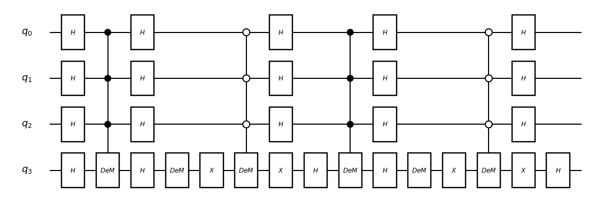
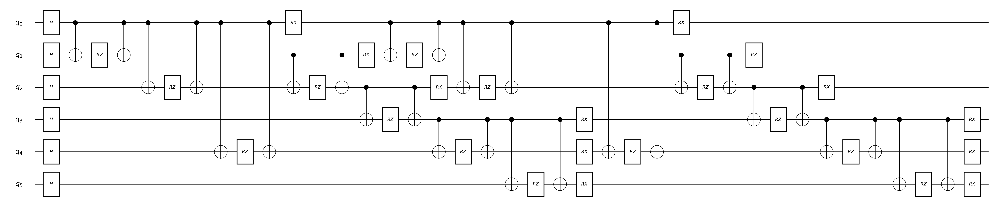

# Part 3 - Quantum statevector simulation on Deucalion

- [Part 3 - Quantum statevector simulation on Deucalion](#part-3---quantum-statevector-simulation-on-deucalion)
  - [1. Slurm Basics ](#1-slurm-basics-)
    - [1.1 Create a batch script](#11-create-a-batch-script)
    - [1.2 Submit a batch job](#12-submit-a-batch-job)
    - [1.3 Examine the queue](#13-examine-the-queue)
    - [1.4 Cancel a job](#14-cancel-a-job)
    - [1.5 CPU Jobs](#15-cpu-jobs)
    - [1.6 GPU jobs](#16-gpu-jobs)
  - [2. Distributed statevector simulation on Deucalion's partitions](#2-distributed-statevector-simulation-on-deucalions-partitions)
    - [2.1 ARM partitions](#21-arm-partitions)
    - [2.2 x86 partitions](#22-x86-partitions)
    - [2.3 GPU partitions](#23-gpu-partitions)
  - [3. Examples](#3-examples)
    - [3.1 Hello quantum world](#31-hello-quantum-world)
    - [3.2 Grover's algorithm](#32-grovers-algorithm)
      - [3.2.1 ARM job](#321-arm-job)
      - [3.2.2 GPU job](#322-gpu-job)
    - [3.3 Quantum Approximate Optimization Algorithm (QAOA)](#33-quantum-approximate-optimization-algorithm-qaoa)
  - [4. References and additional information](#4-references-and-additional-information)


## 1. Slurm Basics <a id="2-slurm-basics-"></a>

An HPC cluster consists of multiple compute nodes, each equipped with processors, memory, and GPUs. Users access these resources by submitting jobs, which specify the required resources and how to execute their applications. On Deucalion, resource allocation and job scheduling is managed by [Slurm](https://slurm.schedmd.com/). To learn more about Slurm in a hands-on way, you can explore the interactive [Slurm Learning tutorial](http://slurmlearning.deic.dk/).

The main commands for using Slurm are summarized in the table below.

<div align="center">

| Command   | Description                                               |
|-----------|-----------------------------------------------------------|
| `sbatch`  | Submit a batch script                                     |
| `squeue`  | View information about jobs in the scheduling queue       |
| `scancel` | Signal or cancel jobs, job arrays or job steps            |
| `sinfo`   | View information about nodes and partitions               |

<p><em>Table 1: Common Slurm commands</em></p>
</div>

### 1.1 Create a batch script

The most common type of jobs are batch jobs which are submitted to the
scheduler using a batch job script and the `sbatch` command.

A batch job script is a text file containing information about the job
to be run: the amount of computing resource and the tasks that must be executed.

A batch script is summarized by the following steps:

- the interpreter to use for the execution of the script: bash, python, ...
- directives that define the job options: resources, run time, ...
- setting up the environment: prepare input, environment variables, ...
- run the application(s)

Below is an example batch job script.

```bash
#!/bin/bash
#SBATCH --account=<your account>
#SBATCH --partition=<partition name>
#SBATCH --job-name=<your job name>
#SBATCH --time=02:00:00
#SBATCH --nodes=1
#SBATCH --ntasks=1
#SBATCH --cpus-per-task=1

module load MyApp

MyApp -i input -o output
```

In the previous example, the first line `#!/bin/bash` indicates that this is a bash script.

Lines starting with `#SBATCH` are directives for the workload manager. 

The first directive


```bash
#SBATCH --account=<your account>
```

sets the billed account. To check your available accounts you can run the command

```bash
sacctmgr show Association where User=<username> format=Cluster,Account%30,User
```

where `<username>` is your Deucalion username.

```bash
[johnDoe@ln01 ~]$ sacctmgr show Association where User=JohnDoe format=Cluster,Account%30,User

   Cluster   Account                        User
   --------  ------------------------------ --------
   deucalion i2024000a                     JohnDoe
   deucalion i2024000g                     JohnDoe
   deucalion i2024000x                     JohnDoe
```

Above there is an example for the output of the account listing command. It shows three user accounts along with their associated clusters differing in a single character. These are responsible for indicating which Deucalion partitions the account has access - "a" (ARM) , "g" (GPU) and "x" (x86). 

Provided your account has access to a given partition you can set it in your batch script using the `#SBATCH --partition` directive, by setting the partition name as in Table 2. 

The directive 
```bash
#SBATCH --job-name=<your job name>
```

sets the name of the job so that it can be easily identified in the job queue
and other listings.


The next lines in the script specify the resources required for your job. The most important is the **maximum wall time** your job is allowed to run. If your job exceeds this limit, it will be terminated by the scheduler.

```bash
#SBATCH --time=02:00:00
```

The time is given in `hh:mm:ss` format (or `d-hh:mm:ss` for days). In this example, the job is limited to 2 hours.

The following directives define the compute resources:

```bash
#SBATCH --nodes=1
#SBATCH --ntasks=1
#SBATCH --cpus-per-task=1
```

Here, you are requesting one task (process) on one node, with one CPU core allocated to that task. In most cases, a task corresponds to an MPI rank.

After specifying resources, you typically set up the environment. This may include copying input files to scratch storage or exporting environment variables.

```bash
module load MyApp
```

This command loads the required software module so that the `MyApp` application is available in your environment.

Finally, you launch your application:

```bash
MyApp -i input -o output
```

### 1.2 Submit a batch job

To submit the job script we just created we use the `sbatch` command. The
general syntax can be condensed as

```bash
$ sbatch [options] job_script [job_script_arguments ...]
```

Assuming the script is saved as a shell script named `myjob.sh`, you can submit it with

```bash
[johnDoe@ln01 ~]$ sbatch myjob.sh
Submitted batch job 123456
```

You can also pass arguments in the command line. For instance `sbatch --nodes=2` and `#SBATCH --nodes=2` in a batch script are equivalent. However, command line value takes precedence if the same
option is present both on the command line and as a directive in a script.

### 1.3 Examine the queue

Once you have submitted your batch script it won't necessarily run immediately.
It may wait in the queue of pending jobs for some time before its required
resources become available. In order to view your jobs in the queue, use the
`squeue` command.

```bash
$ squeue
  JOBID PARTITION     NAME     USER  ST       TIME  NODES NODELIST(REASON)
 123456   normal-arm exampleJ johnDoe  PD       0:00      1 (Priority)
```

The output shows the state of your job in the `ST` column. In our case, the job
is pending (`PD`). The last column indicates the reason why the job isn't
running: `Priority`. This indicates that your job is queued behind a higher
priority job. One other possible reason can be that your job is waiting for
resources to become available. In such a case, the value in the `REASON` column
will be `Resources`.

Let's look at the information that will be shown if your job is running. In order
to see only the jobs that belong to you use the `squeue` command with the
`--me` flag.


```bash
$ squeue -me
  JOBID PARTITION     NAME     USER  ST       TIME  NODES NODELIST(REASON)
 123456   normal-arm exampleJ johnDoe  R      35:00      1 node-0123
```

The `ST` column will now display a `R` value (for `RUNNING`). The `TIME` column
will represent the time your job has been running. The list of nodes on which
your job is executing is given in the last column of the output.

### 1.4 Cancel a job

You may need to cancel your job. This can be achieved using the `scancel`
command which takes the job ID of the job to cancel.

```bash
$ scancel <jobid>
```

The job ID can be obtained from the output of the `sbatch` command when
submitting your job or by using `squeue`. 


For more advanced options, please refer to the [Slurm documentation](https://slurm.schedmd.com/documentation.html).

### 1.5 CPU Jobs

CPU-only jobs run on the cluster’s CPUs without GPUs. For multithreaded programs, it’s important to request the right number of cores and bind your threads. The example below runs one task on a single node, gives that task 48 CPU cores, and sets OpenMP variables so threads are pinned and not oversubscribed. On Deucalion's there are several CPU partitions available, check Table 2 for details.

```bash
#!/bin/bash
#SBATCH --account=<account name>
#SBATCH --partition=<cpu partition name, e.g., normal-arm>
#SBATCH --job-name=cpu-example
#SBATCH --time=00:15:00
#SBATCH --nodes=1
#SBATCH --ntasks=1
#SBATCH --cpus-per-task=48

module load MyCPUApp  

# --- OpenMP/Threading best practices ---
export OMP_NUM_THREADS=${SLURM_CPUS_PER_TASK}  # match threads to allocated cores
export OMP_PLACES=cores                        # one thread per core
export OMP_PROC_BIND=spread                    # spread threads across cores

srun MyCPUApp -i input -o output
```

- `OMP_NUM_THREADS` ensures the program uses exactly the cores you requested—no more, no less.

- **`OMP_PROC_BIND=spread` vs `close`**
  - `spread` places threads **as far apart as possible** across the cores in your allocation. This improves **memory bandwidth** and reduces contention—often best for **bandwidth-bound** codes (e.g., state-vector simulation, large BLAS, big arrays).
  - `close` packs threads **near the master thread** increasing **cache locality**—often best for **cache-heavy** kernels with small working sets or lots of **producer→consumer** reuse.

- **Other tips**
  - Set `OMP_DISPLAY_ENV=true` and (if supported) `OMP_DISPLAY_AFFINITY=true` to print the OpenMP runtime’s binding at startup.
  - Compare `spread` vs `close` and a few `--cpus-per-task` values; pick the fastest on your node architecture.
  - SLURM `--hint=nomultithread` asks SLURM to allocate only **one logical CPU per physical core** and to **avoid SMT/Hyper-Threading siblings**. This prevents two OpenMP threads from landing on the same core, which can otherwise cause cache and pipeline contention. Use `--hint=nomultithread` when you want **one thread per core** (the common case for HPC). 
  
### 1.6 GPU jobs

<h3>Single-GPU</h3>

All GPU nodes in Deucalion are non-exclusive, meaning that you can allocate any number of GPUs you ask for. You can allocate them with `--gpus`:

```bash
#!/bin/bash
#SBATCH --account=<account name>
#SBATCH --partition=<partition name>
#SBATCH --nodes=1
#SBATCH --gpus=1
#SBATCH --ntasks=1
#SBATCH --cpus-per-task=32
#SBATCH --time=2:00:00

module load MyModule

srun ./my_gpu_application
```

For every GPU you ask, you must ask for 32 CPUs for instance through `--cpus-per-task`. 

<h3>Multi-GPU in Single Node</h3>
Each node on every GPU partition in Deucalion (see Table 2) is equipped with up to 4 GPUs, all of which can be used simultaneously within a single job. The following job script requests 4 GPUs, fully utilizing a single node:

```bash
#!/bin/bash

#SBATCH --account <account name>
#SBATCH --partition=<partition name>
#SBATCH --time=00:30:00
#SBATCH --nodes=1
#SBATCH --gpus=4
#SBATCH --tasks-per-node=4
#SBATCH --cpus-per-task=32
#SBATCH --output=results/%j.out
#SBATCH --error=results/%j.err

module load  MyModule

srun  ./my_gpu_application
```

`--tasks-per-node=4` ensures that exactly four independent tasks (processes) are launched on each node, matching the number of GPUs available. It is a good practice to check the output of `nvidia-smi` to ensure that you are running at least one process per GPU. Keep in mind that if the number of nodes is not manually specified, the script may still run but SLURM can allocate your GPUs across different nodes which may lead to performance degradation. `--output` and `--error` are optional parameters that specify the file where the standard output and error of the job will be written for easy debugging.

---

<h3>Multi-node</h3>

For multi-node jobs, you should ensure that **every GPU in every node** is being used — otherwise you are underutilizing the resources. It is crucial to ensure one task per GPU (via `--tasks-per-node=4`) and to match CPU allocations accordingly (e.g., `--cpus-per-task=32`) to fully saturate each GPU. This configuration is ideal for large-scale distributed training or simulation workloads using MPI, PyTorch, etc. The example below illustrates how to configure a SLURM job across 4 nodes with 16 GPUs total, aligned with Table 2 specifications for `normal-a100-40`:

```bash
#!/bin/bash

#SBATCH --account=<account name>
#SBATCH --time=00:30:00
#SBATCH --partition=normal-a100-40
#SBATCH --nodes=4
#SBATCH --gpus=16
#SBATCH --tasks-per-node=4
#SBATCH --cpus-per-task=32
#SBATCH --output=results/%j.out

module load MyModule

srun ./my_gpu_application
```
In this setup, `--tasks-per-node=4` ensures that exactly four independent tasks (processes) are launched on each node, matching the number of GPUs available. The total number of tasks across all nodes will therefore be `--ntasks=16` implicitly (4 tasks/node × 4 nodes), which is what `srun` will use to coordinate parallel execution. If needed, you can also explicitly specify `--ntasks=16`, but it’s not required when using `--tasks-per-node` in conjunction with `--nodes`. Ensuring the correct mapping between GPUs and tasks is key for performance, especially in distributed workloads.


## 2. Distributed statevector simulation on Deucalion's partitions

We size by **memory first**. With double precision, the state size is $S(n)=16\cdot 2^n\ \text{bytes}$. We use conservative “safe” per-node budgets (leave room for work buffers/OS):

- **ARM nodes (A64FX, 32 GiB HBM2):** **16 GiB** per node for the state  
- **x86 nodes (2× EPYC 7742, 256 GiB DRAM):** **128 GiB** per node for the state  
- **GPU nodes:** 4× A100 per node with 2× AMD EPYC 7742 (128 CPU cores total)

  - A100-40: **~32 GiB** per GPU for the state (of 40 GB) → 4 GPUs/node ⇒ **128 GiB/node**  
  - A100-80: **~64 GiB** per GPU for the state (of 80 GB) → 4 GPUs/node ⇒ **256 GiB/node**

Assume **1 MPI rank per CPU node**, or **1 rank per GPU** on GPU nodes. Choose the smallest **power-of-two** ranks so that the per-rank slice fits the safe budget.

<div align="center">
  <table>
    <thead>
      <tr>
        <th>Partition name</th>
        <th>Max nodes</th>
        <th>Cores per node</th>
        <th>RAM per node</th>
        <th>Total RAM for statevector (16 bytes/amp)</th>
      </tr>
    </thead>
    <tbody>
      <tr>
        <td>normal-arm</td>
        <td>128</td>
        <td>48</td>
        <td>32 GB</td>
        <td>2 TiB</td>
      </tr>
      <tr>
        <td>large-arm</td>
        <td>512</td>
        <td>48</td>
        <td>32 GB</td>
        <td>16 TiB</td>
      </tr>
      <tr style="border-top: 2px solid #fcfbfbff;">
        <td>normal-x86</td>
        <td>64</td>
        <td>128</td>
        <td>256 GB</td>
        <td>16 TiB</td>
      </tr>
      <tr>
        <td>large-x86</td>
        <td>128</td>
        <td>128</td>
        <td>256 GB</td>
        <td>32 TiB</td>
      </tr>
      <tr style="border-top: 2px solid #fcfbfbff;">
        <td>normal-a100-40</td>
        <td>4</td>
        <td>128</td>
        <td>512 GB</td>
        <td>2 TiB</td>
      </tr>
      <tr>
        <td>normal-a100-80</td>
        <td>4</td>
        <td>128</td>
        <td>512 GB</td>
        <td>2 TiB</td>
      </tr>
    </tbody>
  </table>
  <p><em>Table 2: Standard publicly available partitions on Deucalion, with total RAM available for statevector simulation (assuming 16 bytes per amplitude)</em></p>
</div>

---

### 2.1 ARM partitions

- `normal-arm`: **max 128 nodes**  
- `large-arm` : **max 512 nodes**

Per-node safe = **16 GiB**

<div align="center">

| Qubits | State size | Nodes | Fits in `normal-arm` (≤128) | Fits in `large-arm` (≤512) |
|---:|---:|---:|:--:|:--:|
| 30 | 16 GiB  | 1    | ✅ | ✅ |
| 31 | 32 GiB  | 2    | ✅ | ✅ |
| 32 | 64 GiB  | 4    | ✅ | ✅ |
| 33 | 128 GiB | 8    | ✅ | ✅ |
| 34 | 256 GiB | 16   | ✅ | ✅ |
| 35 | 512 GiB | 32   | ✅ | ✅ |
| 36 | 1 TiB   | 64   | ✅ | ✅ |
| 37 | 2 TiB   | 128  | ✅ | ✅ |
| 38 | 4 TiB   | 256  | ❌ | ✅ |
| 39 | 8 TiB   | 512  | ❌ | ✅ |
| 40 | 16 TiB  | 1024 | ❌ | ❌ |

<p><em>Table 3: Maximum qubits and required nodes for ARM partitions</em></p>
</div>

*Max inside partition:* `normal-arm` → **37 qubits**; `large-arm` → **39 qubits**.

---

### 2.2 x86 partitions

- `normal-x86`: **max 64 nodes**  
- `large-x86` : **max 128 nodes**

Per-node safe = **128 GiB**

<div align="center">

| Qubits | State size | Nodes | Fits in `normal-x86` (≤64) | Fits in `large-x86` (≤128) |
|---:|---:|---:|:--:|:--:|
| 33 | 128 GiB | 1   | ✅ | ✅ |
| 34 | 256 GiB | 2   | ✅ | ✅ |
| 35 | 512 GiB | 4   | ✅ | ✅ |
| 36 | 1 TiB   | 8   | ✅ | ✅ |
| 37 | 2 TiB   | 16  | ✅ | ✅ |
| 38 | 4 TiB   | 32  | ✅ | ✅ |
| 39 | 8 TiB   | 64  | ✅ | ✅ |
| 40 | 16 TiB  | 128 | ❌ | ✅ |
| 41 | 32 TiB  | 256 | ❌ | ❌ |
| 42 | 64 TiB  | 512 | ❌ | ❌ |

<p><em>Table 4: Maximum qubits and required nodes for x86 partitions</em></p>
</div>

*Max inside partition:* `normal-x86` → **39 qubits**; `large-x86` → **40 qubits**.

---

### 2.3 GPU partitions
- CPU: 2× AMD EPYC 7742 (128 CPU cores total)
- `normal-a100-40`: **max 4 nodes**, each **4× A100 40 GB** → **16 GPUs** total in this partition  
    Safe RAM for state: **~32 GiB/GPU** ⇒ **512 GiB** total across the partition
- `normal-a100-80`: **max 4 nodes**, each **4× A100 80 GB** → **16 GPUs** total  
    Safe RAM for state: **~64 GiB/GPU** ⇒ **1 TiB** total across the partition


<div align="center">

| Qubits $n$ | State size | GPUs (min) | Nodes (min) | Fits in partition (≤16 GPUs) |
|---:|---:|---:|---:|:--:|
| 31 | 32 GiB  | 1   | 1 | ✅ |
| 32 | 64 GiB  | 2   | 1 | ✅ |
| 33 | 128 GiB | 4   | 1 | ✅ |
| 34 | 256 GiB | 8   | 2 | ✅ |
| 35 | 512 GiB | 16  | 4 | ✅ |
| 36 | 1 TiB   | 32  | 8 | ❌ |

<p><em>Table 5: Maximum qubits and required GPUs/nodes for `normal-a100-40` GPU partition</em></p>
</div>

*Max inside partition:* **35 qubits** (DP) on `normal-a100-40`.

- `normal-a100-80` (≤4 nodes = 16 GPUs total)

<div align="center">

| Qubits $n$ | State size | GPUs (min) | Nodes (min) | Fits in partition (≤16 GPUs) |
|---:|---:|---:|---:|:--:|
| 32 | 64 GiB  | 1   | 1 | ✅ |
| 33 | 128 GiB | 2   | 1 | ✅ |
| 34 | 256 GiB | 4   | 1 | ✅ |
| 35 | 512 GiB | 8   | 2 | ✅ |
| 36 | 1 TiB   | 16  | 4 | ✅ |
| 37 | 2 TiB   | 32  | 8 | ❌ |

<p><em>Table 6: Maximum qubits and required GPUs/nodes for `normal-a100-80` GPU partition</em></p>
</div>

## 3. Examples

### 3.1 Hello quantum world
As a first example on Deucalion, we’ll build an n-qubit GHZ state using Qulacs (a fast state-vector simulator). On Deucalion, several quantum frameworks are preinstalled as modules; you load them like any other software. In this example we assume Python and Qulacs, which you can load inside the jobscript with `module load qulacs`. ( You can check quantum based modules on deucalion using the command `module avail`). Qulacs is a high-performance, versatile quantum circuit simulator developed for quantum computing research. Written primarily in C++ with optimized backend implementations (including CPU parallelization via OpenMP, SIMD optimizations) and user-friendly Python bindings, Qulacs aims to provide researchers with one of the fastest simulation environments available.

On the Deucalion supercomputer, Qulacs has been installed and tested, leveraging the system's large-scale distributed computing capabilities to simulate quantum systems beyond the reach of typical workstations and up to 40 qubits at the ARM partition.

Qulacs is a high-performance CPU-based statevector simulator optimized with OpenMP and vectorized kernels, making it well-suited for Deucalion’s ARM nodes (see Table 2 for core and memory details). For example, simulating a 28-qubit GHZ state requires a statevector with $2^{28}$ complex amplitudes (about 4 GiB for `complex128`), which fits easily within a single ARM node’s memory. This allows you to run single-node jobs efficiently. On Deucalion, quantum simulation frameworks like Qulacs are available as modules—simply load Qulacs with `module load qulacs` in your job script. You can try this example yourself using the script in `scripts/ghz`.


```python
from qulacs import QuantumCircuit, QuantumState
import time 
from argparse import ArgumentParser

# ---- Args ----
parser = ArgumentParser()
parser.add_argument("--n_qubits", type=int, default=2, help="Number of qubits")
args = parser.parse_args()

# ---- Parameters ----
n = args.n_qubits

# apply hadamard gate to first qubit
circuit = QuantumCircuit(n)
circuit.add_H_gate(0)
for i in range(1, n):
    # apply CNOT gate to all other qubits
    circuit.add_CNOT_gate(0, i)


#Update state and save time
time_start = time.time()
state = QuantumState(n)
state.set_zero_state()
circuit.update_quantum_state(state)
time_end = time.time()

#get probability of all zero state
prob_zero = state.get_probability([0] * n)
#get probability of all one state
prob_one = state.get_probability([1] * n)

print(f"Time taken to update state {n} qubits: {time_end - time_start:.6f} seconds")
print(f"Probability of all zero state: {prob_zero:.6f}")
print(f"Probability of all one state: {prob_one:.6f}")
```
What the Python script does:
1.	Parses `--n_qubits` (default 2).
2.	Builds a circuit: H on qubit 0, then CNOT(0→i) for i=1..n-1 → prepares GHZ_n.
3.	Creates `QuantumState(n)` (starts in $|0\rangle^n$), applies the circuit, and saves the time it takes to get the amplitudes.
4.	Prints the probability of the all zero and all ones states and the elapsed time.

⚠️ For large n printing the full vector is huge; it’s common to instead print only selected amplitudes or summary stats.

Then we create the following jobscript:
```bash
#!/bin/bash
#SBATCH --job-name=qulacs-ghz
#SBATCH --account=<your account>
#SBATCH --partition=normal-arm
#SBATCH --time=00:30:00

#SBATCH --nodes=1
#SBATCH --ntasks=1
#SBATCH --cpus-per-task=48
#SBATCH --hint=nomultithread
#SBATCH --exclusive

#SBATCH -o ghz_%j.out
#SBATCH -e ghz_%j.err

ml qulacs

# Set OpenMP environment variables
export OMP_NUM_THREADS=48              # or: ${SLURM_CPUS_PER_TASK}
export OMP_PLACES=cores
export OMP_PROC_BIND=spread            # try 'close' vs 'spread' and benchmark

srun python ghz.py --n_qubits 30 
```

What the jobscript does (step-by-step):

1.	Chooses account, normal-arm partition, wall-time, and a single node.
2.	Runs 1 task `--ntasks=1` with 48 CPU cores `--cpus-per-task=48`, no SMT `--hint=nomultithread`, and exclusive node use.
3.	Loads Qulacs via the module system (ml qulacs).
4.	Sets OpenMP controls so Qulacs threads match the cores reserved and are pinned to cores (PLACES=cores, PROC_BIND=spread).
5.	Launches the program with srun, passing `--n_qubits=30`.

Imagine that you would like to run the algorithm for a set of qubits. You can use a job array `--array=4-30` to launch one run per $n \in [4 \dots 30]$. In this case the number of qubits should be attached to the slurm task being executed as `--n_qubits=${SLURM_ARRAY_TASK_ID}`.

How to run and fetch results:

1.	Save the python script as `ghz.py` and jobscript as `jobscript_ghz.sh` in the same directory.
2.	Submit the array job with `sbatch jobscript_ghz.sh`.
3.	Monitor progress with `squeue --me`.
4.	Outputs appear as ghz_<jobid>.out and ghz_<jobid>.err. For timings: `grep "Time taken to update state" ghz_*.out`
5. To inspect a specific task `less ghz_<jobid>.out`


>Now, let's imagine we want to simulate 31 qubits still on the `normal-arm` partition. From Table 3, a 31-qubit double-precision state requires 2 nodes. In this setting, Qulacs supports a distributed state vector off the shelf - we just need to change the way we initialize the quantum state. Now, `QuantumState(n, use_multi_cpu=True)` ensures the amplitudes are partitioned across processes/nodes. 
>
>For distributed quantum state vector simulation you have to make sure that Qulacs
was built with Message Passing Interface ([MPI](https://www.open-mpi.org)) support, which is provided automatically on Deucalion by loading the module `module load qulacs`. 

```python
from mpi4py import MPI
from qulacs import QuantumCircuit, QuantumState
import time
from argparse import ArgumentParser

# MPI handles (no manual Init/Finalize needed)
comm = MPI.COMM_WORLD
rank = comm.Get_rank()
size = comm.Get_size()

# ---- Args ----
parser = ArgumentParser()
parser.add_argument("--n_qubits", type=int, default=31)
args = parser.parse_args()
n = args.n_qubits

# ---- Build GHZ_n: H(0) then CNOT(0->i) for i=1..n-1 ----
circ = QuantumCircuit(n)
circ.add_H_gate(0)
for i in range(1, n):
    circ.add_CNOT_gate(0, i)

# ---- Distributed state across MPI ranks ----
t0 = time.time()
state = QuantumState(n, use_multi_cpu=True)
circ.update_quantum_state(state)
t1 = time.time()

if rank == 0:
    # Print a quick GHZ check instead of the full vector
    p_all0 = state.get_probability([0]*n)
    p_all1 = state.get_probability([1]*n)
    print(f"[INFO] n={n}, ranks={size}, elapsed={t1 - t0:.3f}s")
    print(f"[RESULT] P(|0…0>)={p_all0:.6f}, P(|1…1>)={p_all1:.6f}")
```

1. **Imports & MPI handles**
   - `from mpi4py import MPI` gives access to `COMM_WORLD`, so we can obtain:
     - `rank = comm.Get_rank()` (this process’ ID),
     - `size = comm.Get_Size()` (total number of ranks).

2. **Create a *distributed* quantum state**
   - `state = QuantumState(n, use_multi_cpu=True)` tells Qulacs to **partition the statevector across ranks**.  
     This is the only change required to enable multi-node/multi-rank simulation (assuming Qulacs was built with MPI).

3. **Rank-0 summary output**
   - Only `rank == 0` prints avoiding duplicate output.


To execute the python script let us use the following jobscript:

```bash
#!/bin/bash
#SBATCH --job-name=qulacs-ghz31
#SBATCH --account=<your account>
#SBATCH --partition=normal-arm
#SBATCH --time=00:30:00

#SBATCH --nodes=2
#SBATCH --ntasks=2                 # 1 rank per node (distributed state)
#SBATCH --cpus-per-task=48         # match cores per node
#SBATCH --hint=nomultithread
#SBATCH --exclusive
#SBATCH --output=ghz31_%j.out
#SBATCH --error=ghz31_%j.err

module load qulacs

# OpenMP pinning for each rank
export OMP_NUM_THREADS=${SLURM_CPUS_PER_TASK}
export OMP_PLACES=cores
export OMP_PROC_BIND=spread   # try 'close' vs 'spread' and benchmark

srun python ghz_multicpu.py --n_qubits 31
```

This SLURM script launches a **distributed** Qulacs run across **2 nodes** with **1 MPI rank per node**. Each rank uses **48 OpenMP threads**. Qulacs distributes the state when your Python creates it with `QuantumState(n, use_multi_cpu=True)`.

- `#SBATCH --nodes=2`  
  Reserve **2 nodes** (needed for the 31-qubit distributed example, per resource tables).

- `#SBATCH --ntasks=2`  
  Total MPI ranks = 2 (i.e., **1 rank per node**).   
  > If you want more ranks per node, you may set for instance `--ntasks=4`. In that case, you should also adjust `--cpus-per-task` accordingly. with Qulacs’ distributed state, more ranks ⇒ less state per rank. However, extra ranks increase communication volume/synchronization. Best split depends on the circuit and qubit distribution (communication-heavy gates may favor fewer ranks, more threads).

### 3.2 Grover's algorithm

Grover’s algorithm is the canonical quantum routine for finding a marked item in an **unstructured** database. If a classical search needs $O(N)$ oracle queries to scan $N$ items, Grover promises $O(\sqrt{N})$ queries by repeatedly amplifying the probability of the correct answer. This results in a quadratic speedup. Once you can build the **oracle** for a given problem, the same speedup applies to many tasks (e.g., SAT-style search, or inverting a hash on a fixed domain).

---

Suppose we have $N=2^n$ basis states with bitstrings $x=x_1\ldots x_n$ and $M$ of them are marked as solutions.

1) **Create the uniform superposition.**  
  Start from $|0\rangle^{\otimes n}$ and apply Hadamard gates to all qubits:

  $$
  |s\rangle = H^{\otimes n}|0\ldots 0\rangle
  = \frac{1}{\sqrt{N}} \sum_{x\in\{0,1\}^n} |x\rangle .
  $$

1) **Oracle (phase flip the solutions).**  
  The oracle \(U_w\) flips the phase of solution states and leaves others unchanged:

$$
U_w = I - 2 \sum_{w \in \text{solutions}} |w\rangle \langle w|
$$

$$
U_w|x\rangle =
\begin{cases}
-|x\rangle, & \text{if } x \text{ is a solution},\\
|x\rangle, & \text{otherwise.}
\end{cases}
$$

2) **Diffusion (inversion about the mean and amplitude amplification).**  
  Reflect the state about the average amplitude using

  $$
  U_s = 2|s\rangle\langle s| - I
  $$

3) **Grover iteration.**  
  Apply the pair $U_s U_w$ repeatedly. For
  
  $$
  k \approx O\big(\sqrt{N/M}\big)
  $$

  iterations, the marked subspace has the highest probability amplitude.

4) **Measure.**  
  Measure in the computational basis. With high probability you obtain one of the marked bitstrings \(w\).

--- 

In practice, the optimal number of iterations and probability associated with the marked subspace can be estimated as follows: Let $N=2^n$ be the search space, $M$ the number of marked items. Let $|w\rangle$ and $|w_\perp\rangle$ be the uniform superpositions of the marked and unmarked states, respectively.

Define the angle $\theta$ by

$$
\sin^2\theta=\frac{M}{N}\quad\Longleftrightarrow\quad \theta=\arcsin\sqrt{\frac{M}{N}}
$$

Starting from the uniform state $|s\rangle=\sin\theta|w\rangle+\cos\theta |w_\perp\rangle$ after $k$ Grover iterations the state is

$$
|\psi_k\rangle=\sin\big((2k+1)\theta\big)|w\rangle+\cos\big((2k+1)\theta\big)|w_\perp\rangle
$$

Hence the **success probability** (total probability on all marked states) is

$$
P_k=\sin^2\big((2k+1)\theta\big)
$$

To maximize $P_k$, we want the argument to be as close as possible to $\pi/2$:

$$
(2k+1)\theta \approx \frac{\pi}{2}\quad\Longrightarrow\quad
k^\star \approx \frac{\pi}{4\theta}-\frac{1}{2}
$$

Because $k$ must be an integer, choose

$$
\boxed{k_{\mathrm{opt}}=\left\lfloor \frac{\pi}{4\theta}-\frac{1}{2}\right\rfloor}
$$

Assume $\theta = \arcsin\left(\sqrt{\frac{M}{N}}\right)$ and use $\arcsin(x) \approx x$ for $|x| \ll 1$ (i.e., $M \ll N$). Then

$$
\theta \approx \sqrt{\frac{M}{N}} \qquad
k_{\mathrm{opt}} \approx \frac{\pi}{4\theta} - \frac{1}{2}
\approx
\frac{\pi}{4}\sqrt{\frac{N}{M}} - \frac{1}{2}
$$

> That’s all: **prepare**, **phase-flip**, **diffuse**, **repeat**, **measure**. In the next subsection we’ll map these operators to gates and show a concrete Qulacs implementation suitable for Deucalion’s ARM and GPU nodes.

---

Below we decompose the script into the three core building blocks of Grover’s algorithm—**superposition**, **oracle**, and **diffuser**—and explain how each is implemented in Qulacs. In Sections 3.2.1 and 3.2.2 we will discuss the ARM and GPU implementations, respectively.


Allocate an $n$-qubit **state vector** and turn $|0\rangle^n$ into the uniform superposition by applying a Hadamard to each qubit.

```python
# Allocate the (optionally distributed) state
state = QuantumState(n_qubits, use_multi_cpu=True)
state.set_zero_state()  # |0...0>

# Build H^{⊗n} to create |s>
def make_Hadamard(nqubits):
    Hadamard = QuantumCircuit(nqubits)
    for i in range(nqubits):
        Hadamard.add_gate(H(i))
    return Hadamard

Hadamard = make_Hadamard(n_qubits)
Hadamard.update_quantum_state(state)  # state := |s>
```

>Note: If you run with one rank (--ntasks=1), use_multi_cpu=True simply doesn’t distribute anything (it behaves like the regular state) and threading is still governed by OpenMP.

For the oracle the logic is to apply a global phase (-1) only to the target basis state ($|w\rangle$). The common trick is to map the target to $|11\ldots1\rangle$, apply a multi-controlled Z that flips the phase of $|11\ldots1\rangle$, then undo the mapping.

```python
def Oracle(nqubits, target_state=None):
    U_w = QuantumCircuit(nqubits)

    # 1) Pre-process: X on positions where target bit == 0
    #    This maps the marked string -> all-ones mask.
    for i in range(nqubits):
        if target_state[i] == 0:
            U_w.add_gate(X(i))

    # 2) Multi-controlled Z on the last qubit, controlled on all others being 1
    CnZ = to_matrix_gate(Z(nqubits-1))
    for i in range(nqubits-1):
        CnZ.add_control_qubit(control_index=i, control_with_value=1)
    U_w.add_gate(CnZ)

    # 3) Undo the pre-processing X gates
    for i in range(nqubits):
        if target_state[i] == 0:
            U_w.add_gate(X(i))

    return U_w
``` 
Step (1) turns the specific $|w\rangle$ into $|11\ldots1\rangle$. Step (2) applies a phase flip only when all controls are 1, i.e., on $|11\ldots1\rangle$. Step (3) restores the original computational basis, so only $|w\rangle$ carries the (-1) phase.

The diffuser is expressed by the operator $U_s = 2|s\rangle\langle s| - I$. The standard circuit that realizes it is 

$$
U_s = H^{\otimes n}\big(2|0\rangle\langle 0| - I\big)H^{\otimes n}.
$$

The middle term $(2|0\rangle\langle0| - I)$  is a selective phase flip of the all-zero state.

```python
def Diffuser(nqubits):
    U_s = QuantumCircuit(nqubits)

    # Enter Hadamard basis: |ψ> -> H^{⊗n}|ψ>
    for i in range(nqubits):
        U_s.add_gate(H(i))

    # Implement (2|0><0| - I):
    # - RZ(2π) on the last qubit gives a global -I (phase -1 to all states)
    U_s.add_gate(to_matrix_gate(RZ(nqubits-1, 2*np.pi)))

    # - Toggle the last qubit with X so a subsequent controlled-Z can key off "all controls = 0"
    U_s.add_gate(X(nqubits-1))

    # - Multi-controlled Z acting only when controls are |0> (i.e., on |0...0>)
    CnZ = to_matrix_gate(Z(nqubits-1))
    for i in range(nqubits-1):
        CnZ.add_control_qubit(control_index=i, control_with_value=0)
    U_s.add_gate(CnZ)

    # - Undo the X toggle on the last qubit
    U_s.add_gate(X(nqubits-1))

    # Leave Hadamard basis: apply H^{⊗n} again
    for i in range(nqubits):
        U_s.add_gate(H(i))

    return U_s

```

Now, Grover's algorithm repeats the oracle and diffuser for the optimal number of steps calculated previously. To that end, we first need to define the target state to find. In this case is the all ones bitstring. 

```python
# Mark the all-ones string
marked_state = [1] * n_qubits
U_w = Oracle(n_qubits, target_state=marked_state)
U_s = Diffuser(n_qubits)

# Ideal iteration count ~ floor((π/4)*sqrt(N/M)); here M=1
elements = 1
optimal_iterations = int(np.floor(np.pi/4 * np.sqrt(2**n_qubits / elements)))

# Demo: run 2 Grover iterations (use optimal_iterations for best success prob.)
for i in range(2):
    U_w.update_quantum_state(state)
    U_s.update_quantum_state(state)

# Inspect the final amplitudes (magnitude only)
statevector = abs(state.get_vector())
print("statevector: ", statevector)
```

Additionally you can use `qulacsviz`to visualize the Grover circuit.

```python
def build_grover_circuit(n_qubits, iterations, oracle_circuit, diffuser_circuit, hadamard_circuit):
    grover_circuit = QuantumCircuit(n_qubits)

    grover_circuit.merge_circuit(hadamard_circuit)

    for _ in range(iterations):
        grover_circuit.merge_circuit(oracle_circuit)
        grover_circuit.merge_circuit(diffuser_circuit)
    return grover_circuit

grover_circuit = build_grover_circuit(
    n_qubits=n_qubits,
    iterations=2,
    oracle_circuit=U_w,
    diffuser_circuit=U_s,
    hadamard_circuit=Hadamard
)


circuit_drawer(grover_circuit, 'mpl')
```

That for two Grover iterations would result in the circuit depicted in Figure 1. 

<div align="center">



<p><em>Figure 1: Grover's algorithm circuit for 2 iterations, visualized with qulacsviz.</em></p>

</div>

#### 3.2.1 ARM job

```bash
#!/bin/bash
#SBATCH --job-name=qulacs-grover
#SBATCH --account=<your account>
#SBATCH --partition=normal-arm
#SBATCH --time=00:30:00

#SBATCH --nodes=32
#SBATCH --ntasks=32                 
#SBATCH --cpus-per-task=48   
#SBATCH --exclusive
#SBATCH --output=grover_%j.out
#SBATCH --error=grover_%j.err

module load qulacs

# OpenMP pinning for each rank
export OMP_NUM_THREADS=${SLURM_CPUS_PER_TASK}
export OMP_PLACES=cores
export OMP_PROC_BIND=spread

srun python grover_multicpu.py --n_qubits 31
```
The jobscript above requests 32 nodes and 32 `--ntasks`. From Table 3 using the `normal-arm` partition we would be able to simulate Grover's algorithm up to a maximum of 35 qubits. Test it yourself using the Grover scripts in `scripts/arm_partition/grover`.

#### 3.2.2 GPU job 

```bash 
#!/bin/bash
#SBATCH --job-name=Grover_GPU
#SBATCH --account=<your account>
#SBATCH --partition=normal-a100-40
#SBATCH --nodes=1
#SBATCH --gpus=1
#SBATCH --ntasks=1
#SBATCH --cpus-per-task=32
#SBATCH --time=24:00:00
#SBATCH --mem=0
#SBATCH --array=28
#SBATCH -o grover_gpu_%a_%j.out 
#SBATCH -e grover_gpu_%a_%j.err

# Load environment
ml qulacs/0.6.11-foss-2023a-CUDA-12.1.1

srun python grover_example.py --n_qubits 28
```

This example uses the **GPU-enabled Qulacs module** (`ml qulacs/0.6.11-foss-2023a-CUDA-12.1.1`) rather than the CPU-only build. When running on GPU, your Python code must construct the state with **`QuantumStateGpu`** (not `QuantumState`), e.g.

```python
from qulacs import QuantumCircuit, QuantumStateGpu
state = QuantumStateGpu(n_qubits)      # GPU-backed state vector
# ... build circuit, then:
circuit.update_quantum_state(state)
```

The resource request pairs --gpus=1 with --cpus-per-task=32, a sensible default on normal-a100-40 (see Section 1).

⚠️ Note: As of now, Qulacs does not support a single distributed state vector across multiple GPUs. If you need multi-GPU distribution, you should use a different framework (e.g., nvidia CuQuantum or PennyLane / Qiskit that support easy access to multi-GPU simulation using nvidia CuQuantum as backend). See the provided examples under `scripts/gpu_partition/`.


### 3.3 Quantum Approximate Optimization Algorithm (QAOA)

QAOA is a variational, gate-based algorithm designed for **combinatorial optimization** on near-term (NISQ) devices. Much like quantum annealing, it searches for bitstrings that minimize a classical objective, but it does so with a **parameterized circuit** whose angles are tuned by a classical optimizer. 

QAOA with **constant depth** realizes shallow quantum circuits whose output distributions are, under widely held complexity-theoretic assumptions (e.g., non-collapse of the polynomial hierarchy), **believed to be classically hard to sample** from even approximately. Intuitively, the circuit creates global interference patterns tied to the problem structure; reproducing these correlations with a classical sampler would imply unlikely collapses in complexity classes.

 Practically, this places QAOA in a sweet spot: shallow enough for present hardware, yet rich enough to produce distributions that classical methods are not expected to sample from efficiently—while still allowing **efficient estimation** of the objective by repeated measurements, enabling the hybrid optimization loop.

---

In QAOA, we start with a classical optimization problem defined over $n$-bit strings $z = z_1 z_2 \cdots z_n$, where each $z_i \in \{0,1\}$. The goal is to find a bitstring $z$ that minimizes a given **cost function** $C(z)$. This cost function is typically a sum of local terms:

$$
C(z) = \sum_\alpha C_\alpha(z),
$$

where each $C_\alpha(z)$ depends only on a small subset of the bits, for example, pairwise interactions like $z_i z_j$.

To use QAOA, we map this classical cost function to a **quantum cost Hamiltonian** $C(Z)$ by promoting each classical bit $z_i$ to a spin $s_i = (-1)^{z_i}$ and creating quantum operators $Z_i$ (the Pauli-Z operator acting on qubit $i$). The eigenvalues of $C(Z)$ correspond exactly to the classical costs $C(z)$ for each computational basis state $|z\rangle$.

---

QAOA uses $p$ layers of two unitaries—one from the cost and one from a simple mixing Hamiltonian—applied to a uniform superposition:

$$
|s\rangle = |+\rangle^{\otimes n} = \frac{1}{2^{n/2}}\sum_{z=0}^{2^n-1}|z\rangle
$$

$$
|\beta,\gamma\rangle = U_X(\beta^{(p)})U_C(\gamma^{(p)})\cdots U_X(\beta^{(1)})U_C(\gamma^{(1)})\,|s\rangle
$$

with parameters $\beta=(\beta^{(1)},\ldots,\beta^{(p)})$ and $\gamma=(\gamma^{(1)},\ldots,\gamma^{(p)})$. The layer unitaries are

$$
U_C(\gamma^{(i)})=\exp \big(-i\gamma^{(i)}C(Z)\big)
=\prod_\alpha \exp \big(-i\gamma^{(i)}C_\alpha(Z)\big)
$$

$$
U_X(\beta^{(i)})=\exp \Big(-i \beta^{(i)}\sum_{j=1}^n X_j\Big)
=\prod_{j=1}^n \exp\big(-i \beta^{(i)} X_j\big).
$$

Intuitively, $U_C$ **imprints** problem structure, while $U_X$ **mixes** amplitudes across bitstrings.

---

Given $|\beta,\gamma\rangle$, define the variational objective

$$
F(\beta,\gamma)=\langle \beta,\gamma|C(Z)|\beta,\gamma\rangle
$$


A classical optimizer updates $(\beta,\gamma)$ to **minimize** $F$. The hybrid loop is:

1. Prepare $|s\rangle=|+\rangle^{\otimes n}$.
2. Apply $p$ layers $U_C(\gamma^{(i)})$ and $U_X(\beta^{(i)})$ to obtain $|\beta,\gamma\rangle$.
3. Estimate $F(\beta,\gamma)$ (via repeated measurements/expectations).
4. Classically update $(\beta,\gamma)$ to reduce $F$.
5. Repeat steps 1–4 until convergence, producing $(\beta^*,\gamma^*)$.
6. Sample $|\beta^*,\gamma^*\rangle$; take high-probability bitstrings as candidate solutions.

---

For a graph $G=(V,E)$, Max-Cut seeks a bipartition that **maximizes** the number of edges crossing the cut. Using the $\pm1$ spin convention $s_i=(-1)^{z_i}$, a standard cost is

$$
C(z) = -\frac{1}{2}\sum_{(i,j)\in E}\big(1 - s_i s_j\big)
\quad\Longleftrightarrow\quad
C(Z)=\frac{1}{2}\sum_{(i,j)\in E} Z_i Z_j + \text{(constant)}.
$$

For the 4-vertex cycle, $E=\{(0,1),(1,2),(2,3),(3,0)\}$, so (dropping constants)

$$
C(Z) = \frac{1}{2} \big(Z_0 Z_1+Z_1 Z_2+Z_2 Z_3+Z_3 Z_0\big)
$$

**Implementation hint.** Each two-qubit phase $\exp(-i \gamma Z_i Z_j)$ can be compiled with a **CNOT–RZ–CNOT** pattern:

```math
e^{-i \gamma Z_i Z_j} = \mathrm{CNOT}_{i\to j} \cdot e^{-i \gamma Z_j} \cdot \mathrm{CNOT}_{i\to j}
```

---

- With **$p=1$** (one layer), the ansatz may not be expressive enough to place all probability on optimal cuts, but it often **biases** the outcome toward good solutions.
- Increasing to **$p=2$** (or higher) typically sharpens the distribution around optimal bitstrings and lowers the expected cost $F$, at the expense of more gates and a larger classical search space over $(\beta,\gamma)$.
- Many QAOA targets (Max-Cut, SAT, etc.) are NP-hard. Even a fault-tolerant quantum computer isn’t expected to solve NP-hard problems in polynomial time. QAOA of polynomial depth is universal for quantum computation, but that doesn’t imply polynomial-time optimal solutions to NP-hard problems. 
  
---


Ok now let's implement the QAOA circuit for the Max-Cut problem. Let's draw an (n)-vertex random graph and attach integer weights $w_{ij}\in[\text{low},\text{high}]$ to each edge. This induces the Max-Cut objective: split vertices into two sets to maximize the sum of weights of cut edges.

```python
obs = Observable(n)
obs.add_operator(PauliOperator(f"Z {i} Z {j}", 0.5 * w))
```

We encode (up to an additive constant) the Max-Cut cost as

```math
C(Z)=\tfrac12 \sum_{(i,j)\in E} w_{ij} Z_i Z_j.
```

In Qulacs, an Observable holds a weighted sum of Pauli terms; later we compute $\langle C(Z)\rangle$ directly from the state.


```python 
from qulacs import QuantumState, QuantumCircuit, Observable, PauliOperator
from qulacs.gate import H, CNOT, RX, RZ
from scipy.optimize import minimize
import numpy as np

import networkx as nx
import random


from argparse import ArgumentParser
# ---- Args ----
parser = ArgumentParser()
parser.add_argument("--n_qubits", type=int, default=4, help="Number of qubits")
parser.add_argument("--n_layers", type=int, default=2, help="Number of QAOA layers")
args = parser.parse_args()

# ---- Parameters ----
n = args.n_qubits       # number of qubits / graph vertices
p = args.n_layers       # QAOA depth (number of layers)


#!/usr/bin/env python3
"""
QAOA for weighted Max-Cut in Qulacs (general depth p)
No command-line arguments; edit the variables below.
"""


# =========================
# User-configurable settings that can be made as arguments as well !!! 
# =========================
edge_prob = 0.3          # Erdos–Renyi edge probability
seed = 123               # RNG seed for graph & weights
maxiter = 300            # optimizer iterations
use_multi_cpu = False    # set True if running with MPI-enabled Qulacs (multi-rank)
weights_low, weights_high = 1, 10  # integer edge weights in [low, high]
# =========================

# ---- Build random weighted graph ----
rng = np.random.default_rng(seed)
G = nx.erdos_renyi_graph(n, p=edge_prob, seed=seed)
for (i, j) in G.edges():
    G.edges[i, j]["weight"] = int(rng.integers(weights_low, weights_high + 1))

# ---- Cost observable: C(Z) = 0.5 * sum_{(i,j) in E} w_ij Z_i Z_j ----
def cost_observable_from_graph(G, n):
    obs = Observable(n)
    for (i, j, data) in G.edges(data=True):
        w = float(data["weight"])
        obs.add_operator(PauliOperator(f"Z {i} Z {j}", 0.5 * w))
    return obs

cost_observable = cost_observable_from_graph(G, n)

# ---- QAOA layers ----
# U_C(gamma): for each edge (i,j) with weight w,
#   CNOT(i->j) ; RZ(j, -2*w*gamma) ; CNOT(i->j)
def add_U_C(circuit: QuantumCircuit, gamma: float, G) -> QuantumCircuit:
    for (i, j, data) in G.edges(data=True):
        w = float(data["weight"])
        circuit.add_CNOT_gate(i, j)
        circuit.add_gate(RZ(j, -2.0 * w * gamma))  # RZ(theta) = exp(-i*theta/2 Z)
        circuit.add_CNOT_gate(i, j)
    return circuit

# U_X(beta): RX(q, -2*beta) on every qubit
def add_U_X(circuit: QuantumCircuit, beta: float, n: int) -> QuantumCircuit:
    for q in range(n):
        circuit.add_gate(RX(q, -2.0 * beta))       # RX(theta) = exp(-i*theta/2 X)
    return circuit

# ---- Build p-layer QAOA circuit ----
def build_qaoa_circuit(n: int, G, betas, gammas) -> QuantumCircuit:
    assert len(betas) == len(gammas) == p
    circuit = QuantumCircuit(n)
    # Prepare |s> = |+>^{⊗n}
    for q in range(n):
        circuit.add_H_gate(q)
    # Apply layers: U_C(gamma_l) then U_X(beta_l)
    for l in range(p):
        add_U_C(circuit, gammas[l], G)
        add_U_X(circuit, betas[l], n)
    return circuit

# ---- Expectation of C(Z) for parameters x = [betas..., gammas...] ----
def qaoa_expectation(x: np.ndarray) -> float:
    betas = x[:p]
    gammas = x[p:]
    circ = build_qaoa_circuit(n, G, betas, gammas)
    state = QuantumState(n, use_multi_cpu=use_multi_cpu)
    state.set_zero_state()
    circ.update_quantum_state(state)
    return cost_observable.get_expectation_value(state)

# ---- Optimize parameters ----
x0 = np.concatenate([0.1 * np.ones(p), 0.1 * np.ones(p)])
res = minimize(qaoa_expectation, x0, method="powell", options={"maxiter": maxiter})

print("Optimized cost  ⟨C(Z)⟩:", res.fun)
betas_opt = res.x[:p]
gammas_opt = res.x[p:]
print("Optimized betas:", betas_opt)
print("Optimized gammas:", gammas_opt)

# ---- Rebuild circuit with optimal params and inspect ----
circ_opt = build_qaoa_circuit(n, G, betas_opt, gammas_opt)
state = QuantumState(n, use_multi_cpu=use_multi_cpu)
state.set_zero_state()
circ_opt.update_quantum_state(state)

probs = np.abs(state.get_vector()) ** 2
print("Probabilities:", probs)

# (Optional) report the best bitstring observed in amplitudes (for small n)
best_idx = int(np.argmax(probs))
best_bitstring = format(best_idx, "b").zfill(n)

def maxcut_value(bitstring: str) -> float:
    # Max-Cut value = sum_{(i,j) in E} w_ij * (1 - s_i s_j)/2, with s_i = (-1)^{z_i}
    z = np.array([int(b) for b in bitstring], dtype=int)
    s = 1 - 2*z  # 0->+1, 1->-1
    val = 0.0
    for (i, j, data) in G.edges(data=True):
        w = float(data["weight"])
        val += 0.5 * w * (1.0 - s[i] * s[j])
    return val

print(f"Most probable bitstring: {best_bitstring}")
print(f"Estimated Max-Cut value for it: {maxcut_value(best_bitstring)}")
```

Optional micro-improvements:
- For small n, brute-force the exact Max-Cut to compare against your best sampled bitstring.
- If you’ll scale up, switch from printing the full probability vector to sampling (e.g., state.sampling(K)), then compute cut values for the samples.

You can visualize QAOA's quantum circuit using `qulacsviz` same as in Grover's algorithm (See Section 3.2)

<div align="center">



<p><em>Figure 2: QAOA quantum circuit in Qualacs for Max-Cut on a random graph with two layers, visualized with qulacsviz.</em></p>

</div>

Now, we can execute QAOA algorithm on Deucalion using the follwing jobscript:

```bash
#!/bin/bash
#SBATCH --job-name=QAOA
#SBATCH --account=i20240010a
#SBATCH --partition=normal-arm
#SBATCH --nodes=2
#SBATCH --ntasks=2
#SBATCH --cpus-per-task=48
#SBATCH --time=48:00:00
#SBATCH --mem=0
#SBATCH --exclusive
#SBATCH -o qaoa_%a_%j.out    
#SBATCH -e qaoa_%a_%j.err


# Load environment
ml qulacs
# If SciPy and networkx aren't in your Python env
module load networkx/3.1-foss-2024a
module load SciPy-bundle/2024.05-gfbf-2024a

# Set OpenMP environment variables
export OMP_NUM_THREADS=48
export OMP_PROC_BIND=spread
export OMP_PLACES=cores

# ---- EXECUTE ----------------------------------------------------------
srun python qaoa_qulacs.py --n_qubits 31 --n_layers 2

``` 
- Distributed state enabled in code: make sure your Python uses QuantumState(n, use_multi_cpu=True) when running with `--ntasks>1`; otherwise both ranks will build full copies and run independently.
- SciPy availability: Qulacs use scipy classical optimizers for updating the parameters of the parameterized quantum circuit. Ensure SciPy is present in your module stack/venv (e.g., module load SciPy-bundle/... or your Python env).
  
You can test QAOA yourself by running the provided job script on `scripts/arm_partition/qaoa/`. 
## 4. References and additional information
<li><strong>Qulacs Official Documentation:</strong> <a href="https://qulacs.readthedocs.io/en/latest/">https://qulacs.readthedocs.io/en/latest/</a></li>
<li><strong>Qulacs GitHub Repository:</strong> <a href="https://github.com/qulacs/qulacs">https://github.com/qulacs/qulacs</a></li>
<li><strong>Deucalion User Support:</strong> <a href="mailto:deucalion@support.macc.fccn.pt">Deucalion support</a></li>
<li><strong>Y.Suzuki et.al Qulacs: a fast and versatile quantum circuit simulator for research purpose:</strong> <a href="https://arxiv.org/pdf/2011.13524">https://arxiv.org/pdf/2011.13524</a></li>
<li>M. A. Nielsen and I. L. Chuang, 6.1 The quantum search algorithm of “Quantum Computation and Quantum Information 10th Anniversary Edition“, University Printing House</li>
<li><strong> Quantum Native Dojo:</strong> <a href="https://dojo.qulacs.org/en/latest/index.html">https://dojo.qulacs.org/en/latest/index.html</a></li>
<li><strong>A Quantum Approximate Optimization Algorithm:</strong> E. Farhi, J. Goldstone, S. Gutmann, arXiv:1411.4028 (2014).</li>
